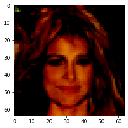

# This Person Doesnt Exist - DCGAN


### What is GAN ?
In generative models, we were always trying to estimate the data distribution by maximum likelihood approach. But in GAN we'll use a whole different approach.
In this approach we have a generative network (as we had before) and we have an extra network called "Discriminator". The discriminator's duty is to recognize fake and real images from each other. The objective for the discriminator is:
$$\text{argmax}_{\theta} \, \mathbb{E}_{x \sim p_{data}} \log[\mathbf{D}_{\theta}(x)] + \mathbb{E}_{x \sim p_{G_{\phi}}} \log[1-\mathbf{D}_{\theta}(x)]$$
And the objective function for generative is:
$$ \text{argmin}_{\phi} \mathbb{E}_{x \sim p_{data}} \log[\mathbf{D}_{\theta}(x)] + \mathbb{E}_{x \sim p_{G_{\phi}}} \log[1-\mathbf{D}_{\theta}(x)] = \text{argmin}_{\phi} \mathbb{E}_{x \sim p_{G_{\phi}}} \log[1-\mathbf{D}_{\theta}(x)]  $$
But I assume that you are enough familiar with GAN where you are seeing this notebook.<br/>
So we won't go on details on GAN. We'll refer you to related papers for each topic.

### Whats is DCGAN?
A DCGAN is a direct extension of the GAN described above, except that it explicitly uses convolutional and convolutional-transpose layers in the discriminator and generator, respectively.<br/>
In the paper Unsupervised <a href="https://arxiv.org/pdf/1511.06434.pdf">Representation Learning With Deep Convolutional Generative Adversarial Networks</a>. The discriminator is made up of strided convolution layers, batch norm layers, and LeakyReLU activations. The input is a 3x64x64 input image and the output is a scalar probability that the input is from the real data distribution. The generator is comprised of convolutional-transpose layers, batch norm layers, and ReLU activations. The input is a latent vector, z
, that is drawn from a standard normal distribution and the output is a 3x64x64 RGB image. The strided conv-transpose layers allow the latent vector to be transformed into a volume with the same shape as an image. In the paper, the authors also give some tips about how to setup the optimizers, how to calculate the loss functions, and how to initialize the model weights, all of which will be explained in the coming sections. <br/>
We'll implement the model based on <a href="https://arxiv.org/pdf/1511.06434.pdf">this mian paper</a>.

### DCGAN with celeba dataset


```
from __future__ import print_function
import argparse
import os
import random
import torch
import torch.nn as nn
import torch.nn.parallel
import torch.backends.cudnn as cudnn
import torch.optim as optim
import torch.utils.data 
import torchvision
import torchvision.datasets as dset
import torchvision.transforms as transforms
import torchvision.utils as vutils
import numpy as np
import matplotlib.pyplot as plt
import matplotlib.animation as animation
from IPython.display import HTML

manualSeed = 999
random.seed(manualSeed)
torch.manual_seed(manualSeed)

print('setup done')
```

    setup done


```

### Batch size during training ###
batch_size = 64

### All images will be resized to this ###
image_size = 64

### Number of channels in the training images. For color images this is 3 ###
nc = 3

### Size of z latent vector ###
nz = 100

### Size of feature maps in generator ###
ngf = 64

### Size of feature maps in discriminator ###
ndf = 64

### Number of training epochs ###
num_epochs = 25

### Learning rate for optimizers ###
lr = 0.0002

### Beta1 hyperparam for Adam optimizers ###
beta1 = 0.5

### Number of GPUs available. Use 0 for CPU mode. ###
ngpu = 1

### During Training details ###
print_every = 250

### The Cuda(GPU) device to use ###
device = torch.device("cuda:0")
```


```
from google.colab import drive
drive.mount('/content/drive')
```


```
import zipfile
with zipfile.ZipFile("./drive/My Drive/CelebA/Img/img_align_celeba.zip", 'r') as zip_ref:
    zip_ref.extractall("./dataset")
```

#### Creating the dataset


#### Dataset 
In this tutorial we will use the <a href="http://mmlab.ie.cuhk.edu.hk/projects/CelebA.html">Celeb-A Faces</a> dataset. <br/>
This dataset has more than 200k photo from people(celebrities) around the world.

In the below cell, You'll see some examples of this dataset.


```
dataset_transforms = transforms.Compose([
        transforms.Resize(image_size),
        transforms.CenterCrop(image_size),
        transforms.ToTensor(),
        transforms.Normalize((0.5, 0.5, 0.5), (0.5, 0.5, 0.5)),
])

dataset = dset.ImageFolder(root='./dataset/', transform=dataset_transforms)

dataloader = torch.utils.data.DataLoader(dataset, batch_size=batch_size, shuffle=True, num_workers=workers)

real_batch = next(iter(dataloader))
plt.figure(figsize=(10,10))
plt.axis("off")
plt.title("Training Images")
plt.imshow(np.transpose(vutils.make_grid(real_batch[0].to(device)[:64], padding=2, normalize=True).cpu(),(1,2,0)))
```


    <matplotlib.image.AxesImage at 0x7f869dc08d68>


### Model Implementation

#### Weight Initialization

From the DCGAN paper, the authors specify that all model weights shall be randomly initialized from a Normal distribution with mean=0, stdev=0.02. The **weights_init** function takes an initialized model as input and reinitializes all convolutional, convolutional-transpose, and batch normalization layers to meet this criteria.


```
def weights_init(m):
    classname = m.__class__.__name__
    if classname.find('Conv') != -1:
        nn.init.normal_(m.weight.data, 0.0, 0.02)
    elif classname.find('BatchNorm') != -1:
        nn.init.normal_(m.weight.data, 1.0, 0.02)
        nn.init.constant_(m.bias.data, 0)
```

#### Generator Network

The generator, G, is designed to map the latent space vector (z) to data-space. Since our data are images, converting z to data-space means ultimately creating a RGB image with the same size as the training images (i.e. 3x64x64). In practice, this is accomplished through a series of strided two dimensional convolutional transpose layers, each paired with a 2d batch norm layer and a relu activation. The output of the generator is fed through a tanh function to return it to the input data range of [−1,1]. It is worth noting the existence of the batch norm functions after the conv-transpose layers, as this is a critical contribution of the DCGAN paper. These layers help with the flow of gradients during training. An image of the generator from the DCGAN paper is shown below.


```
class Generator(nn.Module):
    '''
        The model implementation will be exactly as is described in the paper.
    '''
    def __init__(self):
        super(Generator, self).__init__()
        self.main = nn.Sequential(
            nn.ConvTranspose2d(nz, ngf * 8, 4, 1, 0, bias=False),
            nn.BatchNorm2d(ngf * 8),
            nn.ReLU(True),
            nn.ConvTranspose2d(ngf * 8, ngf * 4, 4, 2, 1, bias=False),
            nn.BatchNorm2d(ngf * 4),
            nn.ReLU(True),
            nn.ConvTranspose2d(ngf * 4, ngf * 2, 4, 2, 1, bias=False),
            nn.BatchNorm2d(ngf * 2),
            nn.ReLU(True),
            nn.ConvTranspose2d(ngf * 2, ngf, 4, 2, 1, bias=False),
            nn.BatchNorm2d(ngf),
            nn.ReLU(True),
            nn.ConvTranspose2d(ngf, nc, 4, 2, 1, bias=False),
            nn.Tanh()
        )

    def forward(self, x):
        return self.main(x)
```

#### Discriminator

As mentioned, the discriminator, $\mathbb D$, is a binary classification network that takes an image as input and outputs a scalar probability that the input image is real (as opposed to fake). Here, $\mathbb D$ takes a 3x64x64 input image, processes it through a series of Conv2d, BatchNorm2d, and LeakyReLU layers, and outputs the final probability through a Sigmoid activation function. This architecture can be extended with more layers if necessary for the problem, but there is significance to the use of the strided convolution, BatchNorm, and LeakyReLUs. The DCGAN paper mentions it is a good practice to use strided convolution rather than pooling to downsample because it lets the network learn its own pooling function. Also batch norm and leaky relu functions promote healthy gradient flow which is critical for the learning process of both G and D.


```
class Discriminator(nn.Module):
    '''
        The model implementation will be exactly as is described in the paper.
    '''
    def __init__(self):
        super(Discriminator, self).__init__()
        self.main = nn.Sequential(
            nn.Conv2d(nc, ndf, 4, 2, 1, bias=False),
            nn.LeakyReLU(0.2, inplace=True),
            nn.Conv2d(ndf, ndf * 2, 4, 2, 1, bias=False),
            nn.BatchNorm2d(ndf * 2),
            nn.LeakyReLU(0.2, inplace=True),
            nn.Conv2d(ndf * 2, ndf * 4, 4, 2, 1, bias=False),
            nn.BatchNorm2d(ndf * 4),
            nn.LeakyReLU(0.2, inplace=True),
            nn.Conv2d(ndf * 4, ndf * 8, 4, 2, 1, bias=False),
            nn.BatchNorm2d(ndf * 8),
            nn.LeakyReLU(0.2, inplace=True),
            nn.Conv2d(ndf * 8, 1, 4, 1, 0, bias=False),
            nn.Sigmoid()
        )

    def forward(self, x):
        return self.main(x)
```


```
### Instantiate the models ###
netG = Generator().to(device)
netG.apply(weights_init)

netD = Discriminator().to(device)
netD.apply(weights_init)
```

#### Loss Functions and Optimizers
With D and G setup, we can specify how they learn through the loss functions and optimizers. We will use the Binary Cross Entropy loss (BCELoss) function.Next, we define our real label as 1 and the fake label as 0. These labels will be used when calculating the losses of D and G, and this is also the convention used in the original GAN paper.<br/>
Finally, we set up two separate optimizers, one for D and one for G. As specified in the DCGAN paper, both are Adam optimizers with learning rate 0.0002 and Beta1 = 0.5.


```
criterion = nn.BCELoss()

fixed_noise = torch.randn(64, nz, 1, 1, device=device)

real_label = 1
fake_label = 0

optimizerD = optim.Adam(netD.parameters(), lr=lr, betas=(beta1, 0.999))
optimizerG = optim.Adam(netG.parameters(), lr=lr, betas=(beta1, 0.999))
```

#### Training

##### **Train the Discriminator**
The goal of training the discriminator is to maximize the probability of correctly classifying a given input as real or fake.
Due to the separate mini-batch suggestion from ganhacks, we will calculate this in two steps. First, we will construct a batch of real samples from the training set, forward pass through D, calculate the loss $\log(D(x))$, then calculate the gradients in a backward pass. Secondly, we will construct a batch of fake samples with the current generator, forward pass this batch through D, calculate the loss $\log(1−D(G(z)))$, and accumulate the gradients with a backward pass. Now, with the gradients accumulated from both the all-real and all-fake batches, we call a step of the Discriminator’s optimizer.


##### **Train the Generator**

As stated in the original paper, we want to train the Generator by minimizing $\log(1−D(G(z)))$ in an effort to generate better fakes. As mentioned, this was shown by Goodfellow to not provide sufficient gradients, especially early in the learning process. As a fix, we instead wish to maximize $\log(D(G(z)))$. In the code we accomplish this by: classifying the Generator output from Part 1 with the Discriminator, computing G’s loss using real labels as GT, computing G’s gradients in a backward pass, and finally updating G’s parameters with an optimizer step.


```
img_list = []
G_losses = []
D_losses = []
iters = 0

for epoch in range(num_epochs):

    for i, (img, _) in enumerate(dataloader, 0):
        ############################
        # (1) Update D network: maximize log(D(x)) + log(1 - D(G(z)))
        ###########################
        ## Train with all-real batch

        netD.zero_grad()
        real_data = img.to(device)
        b_size = real_data.size(0)
        label = torch.full((b_size,), real_label, device=device)

        output = netD(real_data).view(-1)
        errD_real = criterion(output, label)

        errD_real.backward()
        D_x = output.mean().item()

        ## Train with all-fake batch
        noise = torch.randn(b_size, nz, 1, 1, device=device)

        fake = netG(noise)
        label.fill_(fake_label)

        output = netD(fake.detach()).view(-1)
        errD_fake = criterion(output, label)

        errD_fake.backward()
        D_G_z1 = output.mean().item()

        errD = errD_real + errD_fake

        optimizerD.step()

        ############################
        # (2) Update G network: maximize log(D(G(z)))
        ###########################

        netG.zero_grad()
        label.fill_(real_label) 
        output = netD(fake).view(-1)

        errG = criterion(output, label)
        errG.backward()
        D_G_z2 = output.mean().item()

        optimizerG.step()

        # Output training stats
        if i % print_every == 0:
            print('[%d/%d][%d/%d]\tLoss_D: %.4f\tLoss_G: %.4f\tD(x): %.4f\tD(G(z)): %.4f / %.4f'
                  % (epoch, num_epochs, i, len(dataloader),
                     errD.item(), errG.item(), D_x, D_G_z1, D_G_z2))

        G_losses.append(errG.item())
        D_losses.append(errD.item())

        if (iters % 500 == 0) or ((epoch == num_epochs-1) and (i == len(dataloader)-1)):
            with torch.no_grad():
                fake = netG(fixed_noise).detach().cpu()
            img_list.append(vutils.make_grid(fake, padding=2, normalize=True))

        iters += 1
```

    [0/10][0/3166]	Loss_D: 1.8029	Loss_G: 2.2328	D(x): 0.2928	D(G(z)): 0.2728 / 0.1332
    [0/10][100/3166]	Loss_D: 0.4200	Loss_G: 25.4894	D(x): 0.8636	D(G(z)): 0.0000 / 0.0000
    [0/10][200/3166]	Loss_D: 0.4475	Loss_G: 2.3852	D(x): 0.7860	D(G(z)): 0.1014 / 0.1559
    [0/10][300/3166]	Loss_D: 1.0704	Loss_G: 4.6198	D(x): 0.8530	D(G(z)): 0.5381 / 0.0172
    [0/10][400/3166]	Loss_D: 0.4734	Loss_G: 2.4206	D(x): 0.7396	D(G(z)): 0.0793 / 0.1327
    [0/10][500/3166]	Loss_D: 0.8275	Loss_G: 3.5900	D(x): 0.6005	D(G(z)): 0.0773 / 0.0648
    [0/10][600/3166]	Loss_D: 0.5275	Loss_G: 3.6931	D(x): 0.7560	D(G(z)): 0.1508 / 0.0403
    [0/10][700/3166]	Loss_D: 0.4319	Loss_G: 4.9727	D(x): 0.9187	D(G(z)): 0.2490 / 0.0143
    [0/10][800/3166]	Loss_D: 0.5625	Loss_G: 3.6682	D(x): 0.8331	D(G(z)): 0.2629 / 0.0328
    [0/10][900/3166]	Loss_D: 0.5080	Loss_G: 3.5969	D(x): 0.7807	D(G(z)): 0.1415 / 0.0489
    [0/10][1000/3166]	Loss_D: 0.4638	Loss_G: 3.1052	D(x): 0.7491	D(G(z)): 0.1057 / 0.0679
    [0/10][1100/3166]	Loss_D: 1.1237	Loss_G: 2.0428	D(x): 0.4295	D(G(z)): 0.0259 / 0.1996
    [0/10][1200/3166]	Loss_D: 0.3067	Loss_G: 4.3926	D(x): 0.9165	D(G(z)): 0.1612 / 0.0207
    [0/10][1300/3166]	Loss_D: 0.8329	Loss_G: 2.3770	D(x): 0.6409	D(G(z)): 0.1352 / 0.1294
    [0/10][1400/3166]	Loss_D: 0.7214	Loss_G: 2.8139	D(x): 0.6351	D(G(z)): 0.0740 / 0.1276
    [0/10][1500/3166]	Loss_D: 0.4503	Loss_G: 4.7036	D(x): 0.8848	D(G(z)): 0.2369 / 0.0137
    [0/10][1600/3166]	Loss_D: 0.3308	Loss_G: 3.2086	D(x): 0.8494	D(G(z)): 0.1200 / 0.0705
    [0/10][1700/3166]	Loss_D: 0.7829	Loss_G: 2.5653	D(x): 0.5881	D(G(z)): 0.0580 / 0.1536
    [0/10][1800/3166]	Loss_D: 0.5046	Loss_G: 4.2977	D(x): 0.8863	D(G(z)): 0.2637 / 0.0248
    [0/10][1900/3166]	Loss_D: 0.4794	Loss_G: 5.0442	D(x): 0.8804	D(G(z)): 0.2505 / 0.0105
    [0/10][2000/3166]	Loss_D: 0.2901	Loss_G: 3.9412	D(x): 0.8468	D(G(z)): 0.0897 / 0.0363
    [0/10][2100/3166]	Loss_D: 1.0175	Loss_G: 1.7385	D(x): 0.4793	D(G(z)): 0.0260 / 0.2504
    [0/10][2200/3166]	Loss_D: 0.3200	Loss_G: 3.9721	D(x): 0.8973	D(G(z)): 0.1581 / 0.0275
    [0/10][2300/3166]	Loss_D: 0.5291	Loss_G: 3.4604	D(x): 0.7986	D(G(z)): 0.2112 / 0.0556
    [0/10][2400/3166]	Loss_D: 0.7496	Loss_G: 1.9591	D(x): 0.5613	D(G(z)): 0.0225 / 0.1904
    [0/10][2500/3166]	Loss_D: 0.6081	Loss_G: 3.4623	D(x): 0.7795	D(G(z)): 0.2204 / 0.0474
    [0/10][2600/3166]	Loss_D: 1.1441	Loss_G: 6.7693	D(x): 0.9657	D(G(z)): 0.6182 / 0.0024
    [0/10][2700/3166]	Loss_D: 0.5067	Loss_G: 4.0452	D(x): 0.8685	D(G(z)): 0.2639 / 0.0282
    [0/10][2800/3166]	Loss_D: 0.4830	Loss_G: 2.2946	D(x): 0.7649	D(G(z)): 0.1212 / 0.1399
    [0/10][2900/3166]	Loss_D: 0.2850	Loss_G: 3.8946	D(x): 0.9514	D(G(z)): 0.1953 / 0.0300
    [0/10][3000/3166]	Loss_D: 0.3437	Loss_G: 3.8126	D(x): 0.9279	D(G(z)): 0.2150 / 0.0298
    [0/10][3100/3166]	Loss_D: 0.6157	Loss_G: 2.8972	D(x): 0.6459	D(G(z)): 0.0212 / 0.0926
    [1/10][0/3166]	Loss_D: 0.4424	Loss_G: 2.7034	D(x): 0.7703	D(G(z)): 0.1334 / 0.0965
    [1/10][100/3166]	Loss_D: 1.6580	Loss_G: 1.4049	D(x): 0.3151	D(G(z)): 0.0359 / 0.3317
    [1/10][200/3166]	Loss_D: 0.5997	Loss_G: 3.3372	D(x): 0.6303	D(G(z)): 0.0284 / 0.0673
    [1/10][300/3166]	Loss_D: 0.7782	Loss_G: 2.1472	D(x): 0.6296	D(G(z)): 0.1728 / 0.1634
    [1/10][400/3166]	Loss_D: 0.7020	Loss_G: 1.9233	D(x): 0.5769	D(G(z)): 0.0614 / 0.1957
    [1/10][500/3166]	Loss_D: 0.7632	Loss_G: 3.6046	D(x): 0.8968	D(G(z)): 0.4178 / 0.0431
    [1/10][600/3166]	Loss_D: 0.4662	Loss_G: 3.1838	D(x): 0.8757	D(G(z)): 0.2497 / 0.0505
    [1/10][700/3166]	Loss_D: 1.1407	Loss_G: 1.5861	D(x): 0.3964	D(G(z)): 0.0310 / 0.3008
    [1/10][800/3166]	Loss_D: 0.5424	Loss_G: 3.4198	D(x): 0.8628	D(G(z)): 0.2849 / 0.0435
    [1/10][900/3166]	Loss_D: 0.4894	Loss_G: 3.8808	D(x): 0.8528	D(G(z)): 0.2410 / 0.0294
    [1/10][1000/3166]	Loss_D: 1.0468	Loss_G: 1.3265	D(x): 0.4820	D(G(z)): 0.1222 / 0.3561
    [1/10][1100/3166]	Loss_D: 0.5503	Loss_G: 3.5911	D(x): 0.9289	D(G(z)): 0.3395 / 0.0409
    [1/10][1200/3166]	Loss_D: 0.8059	Loss_G: 3.7947	D(x): 0.9590	D(G(z)): 0.4872 / 0.0298
    [1/10][1300/3166]	Loss_D: 0.9317	Loss_G: 4.8110	D(x): 0.9033	D(G(z)): 0.5027 / 0.0116
    [1/10][1400/3166]	Loss_D: 1.5011	Loss_G: 5.3512	D(x): 0.8888	D(G(z)): 0.6889 / 0.0080
    [1/10][1500/3166]	Loss_D: 0.4755	Loss_G: 3.6932	D(x): 0.8842	D(G(z)): 0.2600 / 0.0350
    [1/10][1600/3166]	Loss_D: 0.7603	Loss_G: 5.0920	D(x): 0.9700	D(G(z)): 0.4563 / 0.0116
    [1/10][1700/3166]	Loss_D: 0.4504	Loss_G: 2.9805	D(x): 0.8506	D(G(z)): 0.2281 / 0.0642
    [1/10][1800/3166]	Loss_D: 0.4319	Loss_G: 2.1674	D(x): 0.8492	D(G(z)): 0.2010 / 0.1506
    [1/10][1900/3166]	Loss_D: 0.7220	Loss_G: 3.5628	D(x): 0.8803	D(G(z)): 0.3874 / 0.0406
    [1/10][2000/3166]	Loss_D: 0.8249	Loss_G: 2.3061	D(x): 0.7304	D(G(z)): 0.3179 / 0.1224
    [1/10][2100/3166]	Loss_D: 0.3584	Loss_G: 3.0735	D(x): 0.8560	D(G(z)): 0.1634 / 0.0654
    [1/10][2200/3166]	Loss_D: 0.7787	Loss_G: 2.5544	D(x): 0.6472	D(G(z)): 0.1881 / 0.1002
    [1/10][2300/3166]	Loss_D: 0.6641	Loss_G: 4.7641	D(x): 0.8923	D(G(z)): 0.3562 / 0.0121
    [1/10][2400/3166]	Loss_D: 0.7374	Loss_G: 1.9994	D(x): 0.5748	D(G(z)): 0.0787 / 0.1784
    [1/10][2500/3166]	Loss_D: 0.9967	Loss_G: 1.3233	D(x): 0.4754	D(G(z)): 0.0509 / 0.3317
    [1/10][2600/3166]	Loss_D: 0.7687	Loss_G: 2.3775	D(x): 0.7053	D(G(z)): 0.2855 / 0.1128
    [1/10][2700/3166]	Loss_D: 1.1405	Loss_G: 4.9038	D(x): 0.8818	D(G(z)): 0.5700 / 0.0106
    [1/10][2800/3166]	Loss_D: 0.9183	Loss_G: 1.3252	D(x): 0.4876	D(G(z)): 0.0274 / 0.3451
    [1/10][2900/3166]	Loss_D: 0.4937	Loss_G: 2.7590	D(x): 0.8532	D(G(z)): 0.2365 / 0.0817
    [1/10][3000/3166]	Loss_D: 0.4147	Loss_G: 2.4382	D(x): 0.8535	D(G(z)): 0.1992 / 0.1211
    [1/10][3100/3166]	Loss_D: 0.7511	Loss_G: 1.2876	D(x): 0.6335	D(G(z)): 0.1739 / 0.3247
    [2/10][0/3166]	Loss_D: 0.8794	Loss_G: 2.0086	D(x): 0.4963	D(G(z)): 0.0259 / 0.1868
    [2/10][100/3166]	Loss_D: 0.4890	Loss_G: 2.4840	D(x): 0.7506	D(G(z)): 0.1428 / 0.1137
    [2/10][200/3166]	Loss_D: 0.7134	Loss_G: 4.4767	D(x): 0.9188	D(G(z)): 0.4239 / 0.0178
    [2/10][300/3166]	Loss_D: 0.6069	Loss_G: 1.3992	D(x): 0.6444	D(G(z)): 0.0819 / 0.3302
    [2/10][400/3166]	Loss_D: 0.8441	Loss_G: 4.7736	D(x): 0.8369	D(G(z)): 0.4210 / 0.0181
    [2/10][500/3166]	Loss_D: 1.0131	Loss_G: 4.0421	D(x): 0.8573	D(G(z)): 0.4706 / 0.0282
    [2/10][600/3166]	Loss_D: 0.4552	Loss_G: 1.8508	D(x): 0.7498	D(G(z)): 0.1238 / 0.1845
    [2/10][700/3166]	Loss_D: 0.5016	Loss_G: 3.4681	D(x): 0.8072	D(G(z)): 0.2075 / 0.0424
    [2/10][800/3166]	Loss_D: 0.4737	Loss_G: 3.0938	D(x): 0.7734	D(G(z)): 0.1545 / 0.0636
    [2/10][900/3166]	Loss_D: 0.3282	Loss_G: 2.8922	D(x): 0.8661	D(G(z)): 0.1450 / 0.0778
    [2/10][1000/3166]	Loss_D: 0.7458	Loss_G: 2.1798	D(x): 0.6596	D(G(z)): 0.1939 / 0.1552
    [2/10][1100/3166]	Loss_D: 0.4391	Loss_G: 3.6143	D(x): 0.8050	D(G(z)): 0.1672 / 0.0348
    [2/10][1200/3166]	Loss_D: 0.3291	Loss_G: 3.0109	D(x): 0.8719	D(G(z)): 0.1591 / 0.0672
    [2/10][1300/3166]	Loss_D: 0.6794	Loss_G: 2.2176	D(x): 0.5729	D(G(z)): 0.0435 / 0.1490
    [2/10][1400/3166]	Loss_D: 0.5510	Loss_G: 3.3668	D(x): 0.8093	D(G(z)): 0.2530 / 0.0474
    [2/10][1500/3166]	Loss_D: 0.8291	Loss_G: 4.5640	D(x): 0.9362	D(G(z)): 0.4661 / 0.0139
    [2/10][1600/3166]	Loss_D: 0.3275	Loss_G: 3.3776	D(x): 0.8838	D(G(z)): 0.1610 / 0.0472
    [2/10][1700/3166]	Loss_D: 0.3685	Loss_G: 3.5028	D(x): 0.9061	D(G(z)): 0.2143 / 0.0414
    [2/10][1800/3166]	Loss_D: 0.8688	Loss_G: 0.9241	D(x): 0.5562	D(G(z)): 0.1164 / 0.4623
    [2/10][1900/3166]	Loss_D: 0.5369	Loss_G: 3.6508	D(x): 0.8457	D(G(z)): 0.2775 / 0.0338
    [2/10][2000/3166]	Loss_D: 0.5266	Loss_G: 2.2818	D(x): 0.7380	D(G(z)): 0.1580 / 0.1318
    [2/10][2100/3166]	Loss_D: 0.7903	Loss_G: 2.4579	D(x): 0.7363	D(G(z)): 0.2845 / 0.1141
    [2/10][2200/3166]	Loss_D: 0.5663	Loss_G: 3.4950	D(x): 0.8498	D(G(z)): 0.3018 / 0.0394
    [2/10][2300/3166]	Loss_D: 0.8996	Loss_G: 1.5452	D(x): 0.4830	D(G(z)): 0.0229 / 0.3151
    [2/10][2400/3166]	Loss_D: 0.4342	Loss_G: 3.7051	D(x): 0.8556	D(G(z)): 0.2072 / 0.0351
    [2/10][2500/3166]	Loss_D: 0.4107	Loss_G: 2.8650	D(x): 0.8418	D(G(z)): 0.1605 / 0.0857
    [2/10][2600/3166]	Loss_D: 0.3279	Loss_G: 2.6625	D(x): 0.8156	D(G(z)): 0.0929 / 0.0945
    [2/10][2700/3166]	Loss_D: 0.9599	Loss_G: 3.1656	D(x): 0.7506	D(G(z)): 0.3923 / 0.0666
    [2/10][2800/3166]	Loss_D: 1.0128	Loss_G: 6.3220	D(x): 0.9875	D(G(z)): 0.5765 / 0.0029
    [2/10][2900/3166]	Loss_D: 0.5870	Loss_G: 1.8819	D(x): 0.6736	D(G(z)): 0.1039 / 0.2046
    [2/10][3000/3166]	Loss_D: 0.5446	Loss_G: 1.6121	D(x): 0.6622	D(G(z)): 0.0712 / 0.2341
    [2/10][3100/3166]	Loss_D: 0.4324	Loss_G: 2.6211	D(x): 0.7158	D(G(z)): 0.0434 / 0.0992
    [3/10][0/3166]	Loss_D: 0.4586	Loss_G: 2.9521	D(x): 0.8442	D(G(z)): 0.2194 / 0.0679
    [3/10][100/3166]	Loss_D: 0.5487	Loss_G: 4.0309	D(x): 0.8954	D(G(z)): 0.3162 / 0.0245
    [3/10][200/3166]	Loss_D: 0.4580	Loss_G: 2.9088	D(x): 0.8736	D(G(z)): 0.2432 / 0.0710
    [3/10][300/3166]	Loss_D: 0.4384	Loss_G: 3.9697	D(x): 0.9125	D(G(z)): 0.2662 / 0.0244
    [3/10][400/3166]	Loss_D: 0.5467	Loss_G: 1.3052	D(x): 0.6836	D(G(z)): 0.0914 / 0.3416
    [3/10][500/3166]	Loss_D: 0.8842	Loss_G: 2.9298	D(x): 0.7442	D(G(z)): 0.3336 / 0.0776
    [3/10][600/3166]	Loss_D: 0.3793	Loss_G: 2.5407	D(x): 0.8308	D(G(z)): 0.1532 / 0.1079
    [3/10][700/3166]	Loss_D: 2.0669	Loss_G: 0.0328	D(x): 0.2035	D(G(z)): 0.1201 / 0.9684
    [3/10][800/3166]	Loss_D: 0.7837	Loss_G: 1.1958	D(x): 0.5395	D(G(z)): 0.0695 / 0.3563
    [3/10][900/3166]	Loss_D: 0.5380	Loss_G: 4.0941	D(x): 0.9259	D(G(z)): 0.3347 / 0.0248
    [3/10][1000/3166]	Loss_D: 0.6917	Loss_G: 4.2558	D(x): 0.9462	D(G(z)): 0.4106 / 0.0203
    [3/10][1100/3166]	Loss_D: 0.8494	Loss_G: 1.5942	D(x): 0.6518	D(G(z)): 0.2378 / 0.2721
    [3/10][1200/3166]	Loss_D: 0.6485	Loss_G: 1.7311	D(x): 0.5967	D(G(z)): 0.0413 / 0.2525
    [3/10][1300/3166]	Loss_D: 0.3039	Loss_G: 3.2023	D(x): 0.8226	D(G(z)): 0.0874 / 0.0583
    [3/10][1400/3166]	Loss_D: 0.3767	Loss_G: 4.5209	D(x): 0.9261	D(G(z)): 0.2382 / 0.0146
    [3/10][1500/3166]	Loss_D: 0.3411	Loss_G: 3.3988	D(x): 0.7747	D(G(z)): 0.0445 / 0.0544
    [3/10][1600/3166]	Loss_D: 0.5248	Loss_G: 3.5287	D(x): 0.9509	D(G(z)): 0.3267 / 0.0419
    [3/10][1700/3166]	Loss_D: 1.9978	Loss_G: 0.9806	D(x): 0.2110	D(G(z)): 0.0088 / 0.4626
    [3/10][1800/3166]	Loss_D: 0.4740	Loss_G: 1.7912	D(x): 0.7293	D(G(z)): 0.1035 / 0.2340
    [3/10][1900/3166]	Loss_D: 0.3876	Loss_G: 3.1220	D(x): 0.8465	D(G(z)): 0.1689 / 0.0650
    [3/10][2000/3166]	Loss_D: 0.3571	Loss_G: 3.0556	D(x): 0.8392	D(G(z)): 0.1358 / 0.0670
    [3/10][2100/3166]	Loss_D: 0.6136	Loss_G: 1.4796	D(x): 0.6983	D(G(z)): 0.1608 / 0.2845
    [3/10][2200/3166]	Loss_D: 0.4930	Loss_G: 1.9676	D(x): 0.7093	D(G(z)): 0.0612 / 0.1937
    [3/10][2300/3166]	Loss_D: 0.6657	Loss_G: 2.8494	D(x): 0.8183	D(G(z)): 0.2998 / 0.0778
    [3/10][2400/3166]	Loss_D: 1.4165	Loss_G: 0.8444	D(x): 0.3133	D(G(z)): 0.0133 / 0.4973
    [3/10][2500/3166]	Loss_D: 0.4488	Loss_G: 4.4331	D(x): 0.9506	D(G(z)): 0.2955 / 0.0164
    [3/10][2600/3166]	Loss_D: 0.3141	Loss_G: 3.3435	D(x): 0.7849	D(G(z)): 0.0429 / 0.0520
    [3/10][2700/3166]	Loss_D: 1.2376	Loss_G: 6.7660	D(x): 0.9697	D(G(z)): 0.6306 / 0.0019
    [3/10][2800/3166]	Loss_D: 0.8313	Loss_G: 0.7926	D(x): 0.5104	D(G(z)): 0.0410 / 0.5091
    [3/10][2900/3166]	Loss_D: 0.4233	Loss_G: 2.4713	D(x): 0.7348	D(G(z)): 0.0683 / 0.1192
    [3/10][3000/3166]	Loss_D: 4.0233	Loss_G: 0.0377	D(x): 0.0387	D(G(z)): 0.0133 / 0.9660
    [3/10][3100/3166]	Loss_D: 0.3911	Loss_G: 2.7703	D(x): 0.8020	D(G(z)): 0.1252 / 0.0909
    [4/10][0/3166]	Loss_D: 0.3028	Loss_G: 3.6157	D(x): 0.8908	D(G(z)): 0.1517 / 0.0414
    [4/10][100/3166]	Loss_D: 0.4089	Loss_G: 3.3493	D(x): 0.8364	D(G(z)): 0.1755 / 0.0518
    [4/10][200/3166]	Loss_D: 0.3176	Loss_G: 3.6985	D(x): 0.8792	D(G(z)): 0.1547 / 0.0409
    [4/10][300/3166]	Loss_D: 0.4267	Loss_G: 2.8174	D(x): 0.7741	D(G(z)): 0.1233 / 0.0843
    [4/10][400/3166]	Loss_D: 0.4288	Loss_G: 3.0722	D(x): 0.7919	D(G(z)): 0.1411 / 0.0643
    [4/10][500/3166]	Loss_D: 0.3729	Loss_G: 2.2344	D(x): 0.7896	D(G(z)): 0.1033 / 0.1354
    [4/10][600/3166]	Loss_D: 0.3807	Loss_G: 3.1934	D(x): 0.7491	D(G(z)): 0.0523 / 0.0653
    [4/10][700/3166]	Loss_D: 0.3407	Loss_G: 3.8301	D(x): 0.8059	D(G(z)): 0.0929 / 0.0378
    [4/10][800/3166]	Loss_D: 0.5240	Loss_G: 4.7831	D(x): 0.8959	D(G(z)): 0.2925 / 0.0129
    [4/10][900/3166]	Loss_D: 4.6555	Loss_G: 0.7822	D(x): 0.0196	D(G(z)): 0.0008 / 0.5792
    [4/10][1000/3166]	Loss_D: 0.4602	Loss_G: 3.9079	D(x): 0.8676	D(G(z)): 0.2371 / 0.0278
    [4/10][1100/3166]	Loss_D: 0.2937	Loss_G: 3.3247	D(x): 0.8555	D(G(z)): 0.1016 / 0.0564
    [4/10][1200/3166]	Loss_D: 0.9679	Loss_G: 2.0087	D(x): 0.4884	D(G(z)): 0.0228 / 0.1937
    [4/10][1300/3166]	Loss_D: 0.2678	Loss_G: 2.9121	D(x): 0.8655	D(G(z)): 0.1006 / 0.0818
    [4/10][1400/3166]	Loss_D: 0.4900	Loss_G: 2.0666	D(x): 0.6917	D(G(z)): 0.0558 / 0.1779
    [4/10][1500/3166]	Loss_D: 0.5965	Loss_G: 2.1262	D(x): 0.7005	D(G(z)): 0.1323 / 0.1674
    [4/10][1600/3166]	Loss_D: 0.9222	Loss_G: 1.2260	D(x): 0.4672	D(G(z)): 0.0294 / 0.3782
    [4/10][1700/3166]	Loss_D: 0.1927	Loss_G: 3.8926	D(x): 0.9149	D(G(z)): 0.0869 / 0.0278
    [4/10][1800/3166]	Loss_D: 0.5429	Loss_G: 2.3385	D(x): 0.7337	D(G(z)): 0.1446 / 0.1296
    [4/10][1900/3166]	Loss_D: 0.4583	Loss_G: 4.3181	D(x): 0.9505	D(G(z)): 0.2946 / 0.0197
    [4/10][2000/3166]	Loss_D: 0.4555	Loss_G: 3.6288	D(x): 0.8664	D(G(z)): 0.2237 / 0.0373
    [4/10][2100/3166]	Loss_D: 0.3202	Loss_G: 4.1331	D(x): 0.8849	D(G(z)): 0.1583 / 0.0230
    [4/10][2200/3166]	Loss_D: 0.3987	Loss_G: 3.1849	D(x): 0.8501	D(G(z)): 0.1715 / 0.0633
    [4/10][2300/3166]	Loss_D: 0.3015	Loss_G: 2.8222	D(x): 0.8849	D(G(z)): 0.1408 / 0.0760
    [4/10][2400/3166]	Loss_D: 0.5155	Loss_G: 2.8042	D(x): 0.6774	D(G(z)): 0.0527 / 0.1070
    [4/10][2500/3166]	Loss_D: 0.4147	Loss_G: 2.2961	D(x): 0.7249	D(G(z)): 0.0523 / 0.1389
    [4/10][2600/3166]	Loss_D: 0.3235	Loss_G: 3.6832	D(x): 0.8920	D(G(z)): 0.1652 / 0.0343
    [4/10][2700/3166]	Loss_D: 0.5290	Loss_G: 4.6852	D(x): 0.9790	D(G(z)): 0.3551 / 0.0135
    [4/10][2800/3166]	Loss_D: 0.3187	Loss_G: 3.2763	D(x): 0.8929	D(G(z)): 0.1633 / 0.0534
    [4/10][2900/3166]	Loss_D: 0.3931	Loss_G: 4.1903	D(x): 0.9047	D(G(z)): 0.2173 / 0.0210
    [4/10][3000/3166]	Loss_D: 0.3495	Loss_G: 3.5212	D(x): 0.8687	D(G(z)): 0.1564 / 0.0488
    [4/10][3100/3166]	Loss_D: 0.5510	Loss_G: 2.9566	D(x): 0.7992	D(G(z)): 0.2248 / 0.0665
    [5/10][0/3166]	Loss_D: 0.2156	Loss_G: 2.7331	D(x): 0.8752	D(G(z)): 0.0679 / 0.0984
    [5/10][100/3166]	Loss_D: 0.4251	Loss_G: 2.1429	D(x): 0.7887	D(G(z)): 0.1318 / 0.1507
    [5/10][200/3166]	Loss_D: 0.3068	Loss_G: 3.0403	D(x): 0.8757	D(G(z)): 0.1377 / 0.0677
    [5/10][300/3166]	Loss_D: 0.3290	Loss_G: 3.0988	D(x): 0.8170	D(G(z)): 0.0806 / 0.0628
    [5/10][400/3166]	Loss_D: 0.2525	Loss_G: 3.1756	D(x): 0.9009	D(G(z)): 0.1124 / 0.0588
    [5/10][500/3166]	Loss_D: 0.5941	Loss_G: 5.7432	D(x): 0.9512	D(G(z)): 0.3736 / 0.0044
    [5/10][600/3166]	Loss_D: 0.1771	Loss_G: 3.7957	D(x): 0.9049	D(G(z)): 0.0666 / 0.0342
    [5/10][700/3166]	Loss_D: 0.5924	Loss_G: 2.4221	D(x): 0.7560	D(G(z)): 0.2081 / 0.1249
    [5/10][800/3166]	Loss_D: 0.5242	Loss_G: 1.6632	D(x): 0.6835	D(G(z)): 0.0817 / 0.2421
    [5/10][900/3166]	Loss_D: 0.3239	Loss_G: 2.5841	D(x): 0.7775	D(G(z)): 0.0343 / 0.1062
    [5/10][1000/3166]	Loss_D: 0.2622	Loss_G: 3.9305	D(x): 0.9238	D(G(z)): 0.1487 / 0.0297
    [5/10][1100/3166]	Loss_D: 0.9454	Loss_G: 6.7033	D(x): 0.9547	D(G(z)): 0.5309 / 0.0023
    [5/10][1200/3166]	Loss_D: 1.0867	Loss_G: 4.9134	D(x): 0.9483	D(G(z)): 0.5542 / 0.0123
    [5/10][1300/3166]	Loss_D: 0.2444	Loss_G: 3.2709	D(x): 0.8549	D(G(z)): 0.0579 / 0.0673
    [5/10][1400/3166]	Loss_D: 0.2699	Loss_G: 4.5983	D(x): 0.9392	D(G(z)): 0.1613 / 0.0171
    [5/10][1500/3166]	Loss_D: 1.7048	Loss_G: 1.0673	D(x): 0.2909	D(G(z)): 0.0080 / 0.4456
    [5/10][1600/3166]	Loss_D: 0.3163	Loss_G: 2.5849	D(x): 0.8198	D(G(z)): 0.0829 / 0.1253
    [5/10][1700/3166]	Loss_D: 0.1922	Loss_G: 3.0853	D(x): 0.9017	D(G(z)): 0.0743 / 0.0651
    [5/10][1800/3166]	Loss_D: 0.5705	Loss_G: 2.9405	D(x): 0.7426	D(G(z)): 0.1690 / 0.0816
    [5/10][1900/3166]	Loss_D: 0.2808	Loss_G: 3.7951	D(x): 0.9397	D(G(z)): 0.1703 / 0.0380
    [5/10][2000/3166]	Loss_D: 0.2615	Loss_G: 3.4261	D(x): 0.9012	D(G(z)): 0.1156 / 0.0593
    [5/10][2100/3166]	Loss_D: 0.3141	Loss_G: 2.5939	D(x): 0.7888	D(G(z)): 0.0334 / 0.1181
    [5/10][2200/3166]	Loss_D: 0.2051	Loss_G: 3.2831	D(x): 0.8816	D(G(z)): 0.0633 / 0.0548
    [5/10][2300/3166]	Loss_D: 0.2131	Loss_G: 4.3373	D(x): 0.9555	D(G(z)): 0.1288 / 0.0210
    [5/10][2400/3166]	Loss_D: 0.3351	Loss_G: 1.6899	D(x): 0.7703	D(G(z)): 0.0383 / 0.2480
    [5/10][2500/3166]	Loss_D: 0.3188	Loss_G: 2.1249	D(x): 0.8324	D(G(z)): 0.1082 / 0.1636
    [5/10][2600/3166]	Loss_D: 0.3399	Loss_G: 4.3305	D(x): 0.8934	D(G(z)): 0.1643 / 0.0206
    [5/10][2700/3166]	Loss_D: 0.2741	Loss_G: 3.4627	D(x): 0.8703	D(G(z)): 0.1033 / 0.0436
    [5/10][2800/3166]	Loss_D: 0.5158	Loss_G: 5.8538	D(x): 0.9551	D(G(z)): 0.3316 / 0.0043
    [5/10][2900/3166]	Loss_D: 0.1991	Loss_G: 3.5404	D(x): 0.9030	D(G(z)): 0.0762 / 0.0413
    [5/10][3000/3166]	Loss_D: 1.9557	Loss_G: 6.5956	D(x): 0.9822	D(G(z)): 0.7640 / 0.0031
    [5/10][3100/3166]	Loss_D: 0.3742	Loss_G: 5.6108	D(x): 0.9462	D(G(z)): 0.2497 / 0.0055
    [6/10][0/3166]	Loss_D: 0.2388	Loss_G: 3.9988	D(x): 0.9086	D(G(z)): 0.1203 / 0.0289
    [6/10][100/3166]	Loss_D: 0.1690	Loss_G: 3.7194	D(x): 0.9088	D(G(z)): 0.0601 / 0.0335
    [6/10][200/3166]	Loss_D: 0.4356	Loss_G: 5.4085	D(x): 0.9381	D(G(z)): 0.2787 / 0.0065
    [6/10][300/3166]	Loss_D: 0.6275	Loss_G: 6.7561	D(x): 0.9765	D(G(z)): 0.3944 / 0.0019
    [6/10][400/3166]	Loss_D: 0.2013	Loss_G: 3.7200	D(x): 0.8786	D(G(z)): 0.0547 / 0.0375
    [6/10][500/3166]	Loss_D: 0.1237	Loss_G: 3.3136	D(x): 0.9206	D(G(z)): 0.0343 / 0.0604
    [6/10][600/3166]	Loss_D: 0.2290	Loss_G: 4.3950	D(x): 0.9168	D(G(z)): 0.1064 / 0.0226
    [6/10][700/3166]	Loss_D: 0.2905	Loss_G: 4.6592	D(x): 0.9081	D(G(z)): 0.1494 / 0.0147
    [6/10][800/3166]	Loss_D: 0.1846	Loss_G: 3.7264	D(x): 0.9094	D(G(z)): 0.0737 / 0.0369
    [6/10][900/3166]	Loss_D: 1.5290	Loss_G: 8.6492	D(x): 0.8507	D(G(z)): 0.6244 / 0.0004
    [6/10][1000/3166]	Loss_D: 0.1765	Loss_G: 3.2848	D(x): 0.8911	D(G(z)): 0.0516 / 0.0590
    [6/10][1100/3166]	Loss_D: 0.7929	Loss_G: 7.6691	D(x): 0.9815	D(G(z)): 0.4772 / 0.0008
    [6/10][1200/3166]	Loss_D: 0.2340	Loss_G: 5.1932	D(x): 0.9790	D(G(z)): 0.1601 / 0.0085
    [6/10][1300/3166]	Loss_D: 3.4635	Loss_G: 8.1860	D(x): 0.9994	D(G(z)): 0.9113 / 0.0013
    [6/10][1400/3166]	Loss_D: 0.4470	Loss_G: 1.9147	D(x): 0.7325	D(G(z)): 0.0573 / 0.2100
    [6/10][1500/3166]	Loss_D: 0.1914	Loss_G: 3.4095	D(x): 0.9122	D(G(z)): 0.0733 / 0.0554
    [6/10][1600/3166]	Loss_D: 0.4509	Loss_G: 5.6778	D(x): 0.9666	D(G(z)): 0.2739 / 0.0052
    [6/10][1700/3166]	Loss_D: 0.1645	Loss_G: 3.8314	D(x): 0.9083	D(G(z)): 0.0582 / 0.0341
    [6/10][1800/3166]	Loss_D: 0.2177	Loss_G: 4.5686	D(x): 0.9452	D(G(z)): 0.1381 / 0.0159
    [6/10][1900/3166]	Loss_D: 0.3784	Loss_G: 5.8770	D(x): 0.9661	D(G(z)): 0.2271 / 0.0048
    [6/10][2000/3166]	Loss_D: 0.2466	Loss_G: 3.7750	D(x): 0.9222	D(G(z)): 0.1295 / 0.0353
    [6/10][2100/3166]	Loss_D: 0.4677	Loss_G: 6.9853	D(x): 0.9546	D(G(z)): 0.3075 / 0.0017
    [6/10][2200/3166]	Loss_D: 0.2327	Loss_G: 3.3615	D(x): 0.9097	D(G(z)): 0.1094 / 0.0478
    [6/10][2300/3166]	Loss_D: 0.1834	Loss_G: 4.4141	D(x): 0.9595	D(G(z)): 0.1218 / 0.0175
    [6/10][2400/3166]	Loss_D: 0.8340	Loss_G: 0.8673	D(x): 0.5066	D(G(z)): 0.0169 / 0.4850
    [6/10][2500/3166]	Loss_D: 1.2577	Loss_G: 8.2575	D(x): 0.9659	D(G(z)): 0.6177 / 0.0009
    [6/10][2600/3166]	Loss_D: 0.1618	Loss_G: 3.2532	D(x): 0.8959	D(G(z)): 0.0422 / 0.0551
    [6/10][2700/3166]	Loss_D: 0.2818	Loss_G: 5.5801	D(x): 0.9679	D(G(z)): 0.1946 / 0.0059
    [6/10][2800/3166]	Loss_D: 0.3929	Loss_G: 3.3510	D(x): 0.7368	D(G(z)): 0.0294 / 0.0647
    [6/10][2900/3166]	Loss_D: 0.7591	Loss_G: 2.3135	D(x): 0.7299	D(G(z)): 0.2847 / 0.1412
    [6/10][3000/3166]	Loss_D: 0.2900	Loss_G: 3.4159	D(x): 0.8541	D(G(z)): 0.0971 / 0.0530
    [6/10][3100/3166]	Loss_D: 0.1581	Loss_G: 3.7139	D(x): 0.8913	D(G(z)): 0.0312 / 0.0437
    [7/10][0/3166]	Loss_D: 0.5839	Loss_G: 6.1301	D(x): 0.9967	D(G(z)): 0.3741 / 0.0032
    [7/10][100/3166]	Loss_D: 0.3061	Loss_G: 5.5334	D(x): 0.9723	D(G(z)): 0.2186 / 0.0052
    [7/10][200/3166]	Loss_D: 0.2146	Loss_G: 3.3454	D(x): 0.8560	D(G(z)): 0.0391 / 0.0518
    [7/10][300/3166]	Loss_D: 0.2232	Loss_G: 3.0859	D(x): 0.8800	D(G(z)): 0.0821 / 0.0684
    [7/10][400/3166]	Loss_D: 0.3213	Loss_G: 3.1194	D(x): 0.8354	D(G(z)): 0.0918 / 0.0759
    [7/10][500/3166]	Loss_D: 0.3658	Loss_G: 1.8819	D(x): 0.7473	D(G(z)): 0.0111 / 0.2361
    [7/10][600/3166]	Loss_D: 0.4270	Loss_G: 3.6699	D(x): 0.8270	D(G(z)): 0.1644 / 0.0442
    [7/10][700/3166]	Loss_D: 0.2840	Loss_G: 3.9092	D(x): 0.9401	D(G(z)): 0.1734 / 0.0306
    [7/10][800/3166]	Loss_D: 0.0716	Loss_G: 4.8474	D(x): 0.9657	D(G(z)): 0.0334 / 0.0143
    [7/10][900/3166]	Loss_D: 0.1609	Loss_G: 3.2027	D(x): 0.9087	D(G(z)): 0.0553 / 0.0634
    [7/10][1000/3166]	Loss_D: 0.8883	Loss_G: 2.0044	D(x): 0.5108	D(G(z)): 0.0246 / 0.2371
    [7/10][1100/3166]	Loss_D: 0.3115	Loss_G: 3.6057	D(x): 0.8122	D(G(z)): 0.0588 / 0.0633
    [7/10][1200/3166]	Loss_D: 0.5213	Loss_G: 7.3499	D(x): 0.9975	D(G(z)): 0.3515 / 0.0010
    [7/10][1300/3166]	Loss_D: 0.0617	Loss_G: 4.7473	D(x): 0.9642	D(G(z)): 0.0233 / 0.0152
    [7/10][1400/3166]	Loss_D: 0.2890	Loss_G: 3.5842	D(x): 0.8642	D(G(z)): 0.1007 / 0.0442
    [7/10][1500/3166]	Loss_D: 0.0907	Loss_G: 4.0321	D(x): 0.9757	D(G(z)): 0.0599 / 0.0244
    [7/10][1600/3166]	Loss_D: 0.3517	Loss_G: 3.0623	D(x): 0.7917	D(G(z)): 0.0380 / 0.0937
    [7/10][1700/3166]	Loss_D: 0.5757	Loss_G: 4.9543	D(x): 0.9209	D(G(z)): 0.3222 / 0.0115
    [7/10][1800/3166]	Loss_D: 0.0970	Loss_G: 5.1541	D(x): 0.9527	D(G(z)): 0.0406 / 0.0111
    [7/10][1900/3166]	Loss_D: 0.1562	Loss_G: 3.6474	D(x): 0.9482	D(G(z)): 0.0868 / 0.0377
    [7/10][2000/3166]	Loss_D: 0.1219	Loss_G: 5.0194	D(x): 0.9681	D(G(z)): 0.0768 / 0.0100
    [7/10][2100/3166]	Loss_D: 0.1746	Loss_G: 4.7459	D(x): 0.9540	D(G(z)): 0.1098 / 0.0143
    [7/10][2200/3166]	Loss_D: 0.2870	Loss_G: 3.1223	D(x): 0.8109	D(G(z)): 0.0419 / 0.0734
    [7/10][2300/3166]	Loss_D: 0.0767	Loss_G: 4.9948	D(x): 0.9516	D(G(z)): 0.0221 / 0.0155
    [7/10][2400/3166]	Loss_D: 0.3036	Loss_G: 4.0292	D(x): 0.7768	D(G(z)): 0.0065 / 0.0323
    [7/10][2500/3166]	Loss_D: 0.1095	Loss_G: 4.3399	D(x): 0.9684	D(G(z)): 0.0682 / 0.0216
    [7/10][2600/3166]	Loss_D: 0.4068	Loss_G: 3.2957	D(x): 0.9204	D(G(z)): 0.2129 / 0.0551
    [7/10][2700/3166]	Loss_D: 0.1303	Loss_G: 4.3141	D(x): 0.9327	D(G(z)): 0.0499 / 0.0240
    [7/10][2800/3166]	Loss_D: 0.1394	Loss_G: 4.0062	D(x): 0.9155	D(G(z)): 0.0347 / 0.0352
    [7/10][2900/3166]	Loss_D: 0.5011	Loss_G: 2.1383	D(x): 0.7095	D(G(z)): 0.0537 / 0.2284
    [7/10][3000/3166]	Loss_D: 0.3385	Loss_G: 4.5355	D(x): 0.9754	D(G(z)): 0.2239 / 0.0205
    [7/10][3100/3166]	Loss_D: 0.1631	Loss_G: 3.0416	D(x): 0.9285	D(G(z)): 0.0698 / 0.0604
    [8/10][0/3166]	Loss_D: 0.0492	Loss_G: 5.4338	D(x): 0.9655	D(G(z)): 0.0127 / 0.0079
    [8/10][100/3166]	Loss_D: 0.2684	Loss_G: 2.7058	D(x): 0.8611	D(G(z)): 0.0524 / 0.1048
    [8/10][200/3166]	Loss_D: 0.1638	Loss_G: 4.8341	D(x): 0.9312	D(G(z)): 0.0710 / 0.0136
    [8/10][300/3166]	Loss_D: 0.6871	Loss_G: 7.3325	D(x): 0.9847	D(G(z)): 0.4172 / 0.0012
    [8/10][400/3166]	Loss_D: 0.1595	Loss_G: 4.5394	D(x): 0.9451	D(G(z)): 0.0831 / 0.0199
    [8/10][500/3166]	Loss_D: 0.0886	Loss_G: 4.5176	D(x): 0.9603	D(G(z)): 0.0439 / 0.0171
    [8/10][600/3166]	Loss_D: 0.2323	Loss_G: 1.8851	D(x): 0.8353	D(G(z)): 0.0284 / 0.2169
    [8/10][700/3166]	Loss_D: 0.1957	Loss_G: 3.9622	D(x): 0.8576	D(G(z)): 0.0116 / 0.0391
    [8/10][800/3166]	Loss_D: 0.0600	Loss_G: 4.0571	D(x): 0.9588	D(G(z)): 0.0161 / 0.0336
    [8/10][900/3166]	Loss_D: 1.1748	Loss_G: 1.5319	D(x): 0.4584	D(G(z)): 0.1634 / 0.2972
    [8/10][1000/3166]	Loss_D: 0.1297	Loss_G: 5.1534	D(x): 0.9529	D(G(z)): 0.0703 / 0.0104
    [8/10][1100/3166]	Loss_D: 0.3040	Loss_G: 5.7409	D(x): 0.9896	D(G(z)): 0.2222 / 0.0056
    [8/10][1200/3166]	Loss_D: 0.1208	Loss_G: 3.8831	D(x): 0.9088	D(G(z)): 0.0164 / 0.0406
    [8/10][1300/3166]	Loss_D: 0.0705	Loss_G: 4.9336	D(x): 0.9642	D(G(z)): 0.0315 / 0.0141
    [8/10][1400/3166]	Loss_D: 0.1697	Loss_G: 5.1256	D(x): 0.9204	D(G(z)): 0.0697 / 0.0119
    [8/10][1500/3166]	Loss_D: 0.2482	Loss_G: 2.9669	D(x): 0.8287	D(G(z)): 0.0285 / 0.0932
    [8/10][1600/3166]	Loss_D: 0.2587	Loss_G: 5.9466	D(x): 0.9922	D(G(z)): 0.1853 / 0.0043
    [8/10][1700/3166]	Loss_D: 0.0722	Loss_G: 5.2466	D(x): 0.9528	D(G(z)): 0.0210 / 0.0100
    [8/10][1800/3166]	Loss_D: 0.1152	Loss_G: 4.3373	D(x): 0.9512	D(G(z)): 0.0555 / 0.0218
    [8/10][1900/3166]	Loss_D: 0.0640	Loss_G: 4.3461	D(x): 0.9595	D(G(z)): 0.0196 / 0.0246
    [8/10][2000/3166]	Loss_D: 0.4411	Loss_G: 3.4379	D(x): 0.9748	D(G(z)): 0.2765 / 0.0499
    [8/10][2100/3166]	Loss_D: 0.2658	Loss_G: 3.9785	D(x): 0.8633	D(G(z)): 0.0851 / 0.0327
    [8/10][2200/3166]	Loss_D: 0.1137	Loss_G: 4.9546	D(x): 0.9380	D(G(z)): 0.0415 / 0.0141
    [8/10][2300/3166]	Loss_D: 0.1467	Loss_G: 4.0754	D(x): 0.9295	D(G(z)): 0.0609 / 0.0308
    [8/10][2400/3166]	Loss_D: 0.0926	Loss_G: 5.0699	D(x): 0.9927	D(G(z)): 0.0765 / 0.0109
    [8/10][2500/3166]	Loss_D: 0.2240	Loss_G: 2.9081	D(x): 0.8601	D(G(z)): 0.0397 / 0.0923
    [8/10][2600/3166]	Loss_D: 0.2024	Loss_G: 5.2701	D(x): 0.9729	D(G(z)): 0.1297 / 0.0089
    [8/10][2700/3166]	Loss_D: 0.1861	Loss_G: 3.3179	D(x): 0.8753	D(G(z)): 0.0396 / 0.0654
    [8/10][2800/3166]	Loss_D: 0.0891	Loss_G: 4.5400	D(x): 0.9684	D(G(z)): 0.0528 / 0.0209
    [8/10][2900/3166]	Loss_D: 0.1677	Loss_G: 3.8429	D(x): 0.9628	D(G(z)): 0.1095 / 0.0379
    [8/10][3000/3166]	Loss_D: 1.3505	Loss_G: 7.5383	D(x): 0.9943	D(G(z)): 0.6119 / 0.0014
    [8/10][3100/3166]	Loss_D: 0.2374	Loss_G: 3.5136	D(x): 0.9093	D(G(z)): 0.1094 / 0.0547
    [9/10][0/3166]	Loss_D: 0.1709	Loss_G: 5.1109	D(x): 0.9942	D(G(z)): 0.1339 / 0.0082
    [9/10][100/3166]	Loss_D: 0.2677	Loss_G: 7.5432	D(x): 0.9965	D(G(z)): 0.2038 / 0.0008
    [9/10][200/3166]	Loss_D: 0.4900	Loss_G: 2.9132	D(x): 0.7055	D(G(z)): 0.0230 / 0.1126
    [9/10][300/3166]	Loss_D: 0.3417	Loss_G: 7.9756	D(x): 0.9963	D(G(z)): 0.2501 / 0.0005
    [9/10][400/3166]	Loss_D: 0.6167	Loss_G: 7.2787	D(x): 0.9928	D(G(z)): 0.3489 / 0.0013
    [9/10][500/3166]	Loss_D: 0.1190	Loss_G: 4.7153	D(x): 0.9748	D(G(z)): 0.0722 / 0.0196
    [9/10][600/3166]	Loss_D: 0.1830	Loss_G: 3.6326	D(x): 0.8692	D(G(z)): 0.0224 / 0.0552
    [9/10][700/3166]	Loss_D: 0.0753	Loss_G: 4.9418	D(x): 0.9619	D(G(z)): 0.0309 / 0.0156
    [9/10][800/3166]	Loss_D: 0.1424	Loss_G: 5.5899	D(x): 0.9911	D(G(z)): 0.1159 / 0.0063
    [9/10][900/3166]	Loss_D: 0.4751	Loss_G: 6.7437	D(x): 0.9405	D(G(z)): 0.2560 / 0.0021
    [9/10][1000/3166]	Loss_D: 0.1749	Loss_G: 4.4535	D(x): 0.8987	D(G(z)): 0.0510 / 0.0216
    [9/10][1100/3166]	Loss_D: 0.0840	Loss_G: 3.6285	D(x): 0.9640	D(G(z)): 0.0435 / 0.0403
    [9/10][1200/3166]	Loss_D: 0.0471	Loss_G: 5.3889	D(x): 0.9729	D(G(z)): 0.0185 / 0.0097
    [9/10][1300/3166]	Loss_D: 0.1264	Loss_G: 5.2102	D(x): 0.9942	D(G(z)): 0.0992 / 0.0090
    [9/10][1400/3166]	Loss_D: 0.0550	Loss_G: 5.6814	D(x): 0.9722	D(G(z)): 0.0242 / 0.0073
    [9/10][1500/3166]	Loss_D: 0.1793	Loss_G: 6.4398	D(x): 0.9858	D(G(z)): 0.1340 / 0.0029
    [9/10][1600/3166]	Loss_D: 0.2406	Loss_G: 5.1545	D(x): 0.9343	D(G(z)): 0.1345 / 0.0099
    [9/10][1700/3166]	Loss_D: 0.1515	Loss_G: 3.1806	D(x): 0.9026	D(G(z)): 0.0298 / 0.0694
    [9/10][1800/3166]	Loss_D: 0.0496	Loss_G: 5.0818	D(x): 0.9734	D(G(z)): 0.0215 / 0.0106
    [9/10][1900/3166]	Loss_D: 1.8802	Loss_G: 4.4896	D(x): 0.9715	D(G(z)): 0.6992 / 0.0401
    [9/10][2000/3166]	Loss_D: 0.2707	Loss_G: 3.4132	D(x): 0.8955	D(G(z)): 0.1128 / 0.0526
    [9/10][2100/3166]	Loss_D: 0.2956	Loss_G: 3.3496	D(x): 0.7883	D(G(z)): 0.0221 / 0.0574
    [9/10][2200/3166]	Loss_D: 0.1570	Loss_G: 5.8919	D(x): 0.9743	D(G(z)): 0.1049 / 0.0054
    [9/10][2300/3166]	Loss_D: 0.2556	Loss_G: 3.2266	D(x): 0.8578	D(G(z)): 0.0706 / 0.0585
    [9/10][2400/3166]	Loss_D: 2.4971	Loss_G: 6.3103	D(x): 0.9546	D(G(z)): 0.8064 / 0.0054
    [9/10][2500/3166]	Loss_D: 0.1549	Loss_G: 3.7309	D(x): 0.8949	D(G(z)): 0.0276 / 0.0454
    [9/10][2600/3166]	Loss_D: 0.0918	Loss_G: 5.3767	D(x): 0.9806	D(G(z)): 0.0655 / 0.0091
    [9/10][2700/3166]	Loss_D: 0.1957	Loss_G: 3.4431	D(x): 0.8552	D(G(z)): 0.0181 / 0.0691
    [9/10][2800/3166]	Loss_D: 0.0911	Loss_G: 4.9813	D(x): 0.9645	D(G(z)): 0.0482 / 0.0135
    [9/10][2900/3166]	Loss_D: 0.2599	Loss_G: 5.2254	D(x): 0.8866	D(G(z)): 0.0877 / 0.0111
    [9/10][3000/3166]	Loss_D: 0.1115	Loss_G: 4.7313	D(x): 0.9617	D(G(z)): 0.0628 / 0.0154
    [9/10][3100/3166]	Loss_D: 0.0530	Loss_G: 4.8209	D(x): 0.9666	D(G(z)): 0.0174 / 0.0152


```
plt.figure(figsize=(10,5))
plt.title("Generator and Discriminator Loss During Training")
plt.plot(G_losses,label="G")
plt.plot(D_losses,label="D")
plt.xlabel("iterations")
plt.ylabel("Loss")
plt.legend()
plt.show()
```


```
real_batch = next(iter(dataloader))

# Plot the real images
plt.figure(figsize=(15,15))
plt.subplot(1,2,1)
plt.axis("off")
plt.title("Real Images")
plt.imshow(np.transpose(vutils.make_grid(real_batch[0].to(device)[:64], padding=5, normalize=True).cpu(),(1,2,0)))

# Plot the fake images from the last epoch
plt.subplot(1,2,2)
plt.axis("off")
plt.title("Fake Images")
plt.imshow(np.transpose(img_list[-1],(1,2,0)))
plt.show()
```


Here are more examples.


```

```

    Clipping input data to the valid range for imshow with RGB data ([0..1] for floats or [0..255] for integers).





```

```

    Clipping input data to the valid range for imshow with RGB data ([0..1] for floats or [0..255] for integers).


```

```

    Clipping input data to the valid range for imshow with RGB data ([0..1] for floats or [0..255] for integers).


