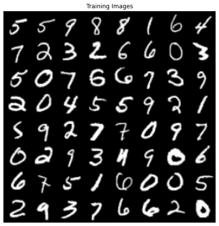
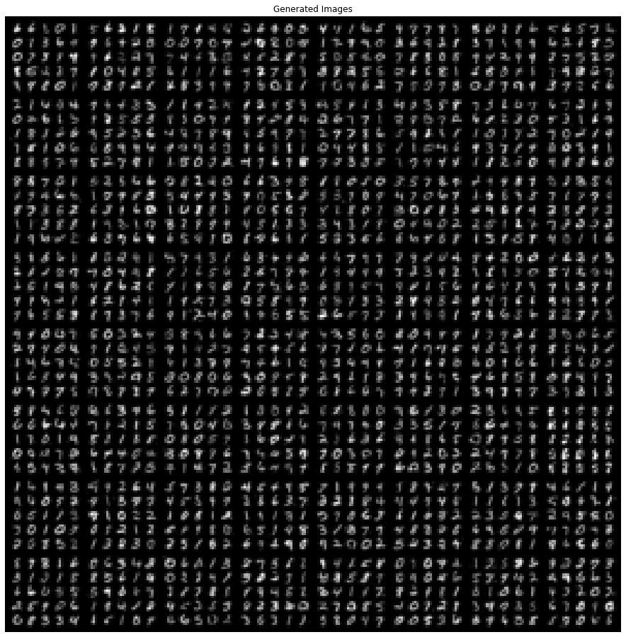
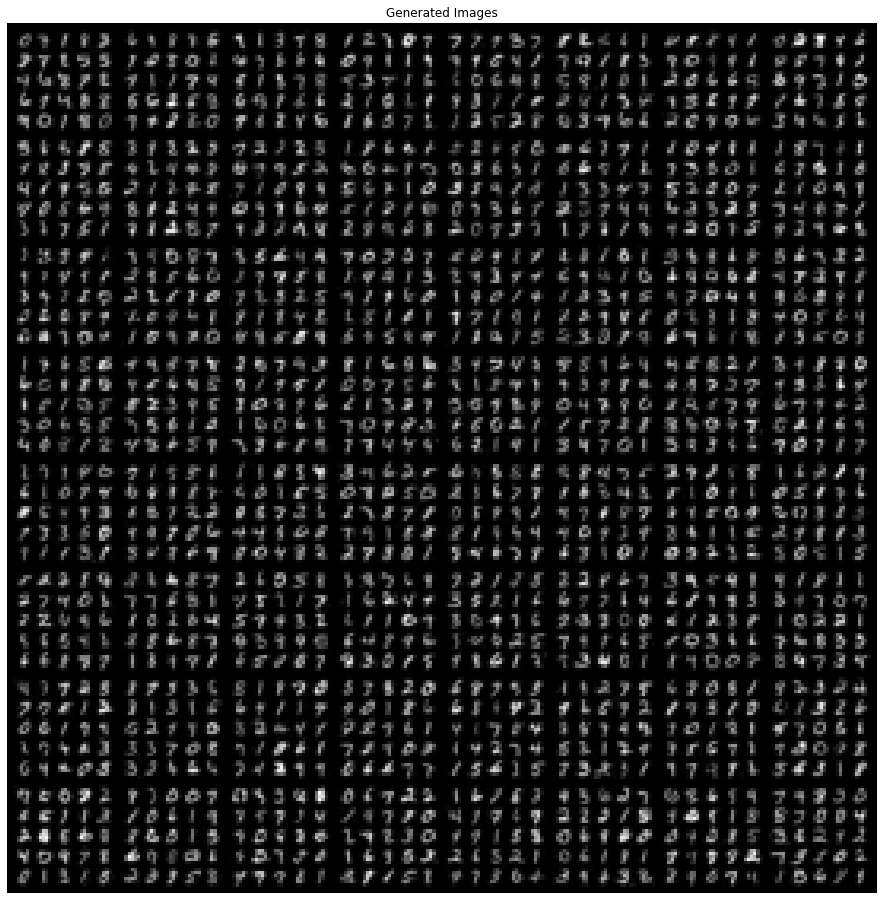
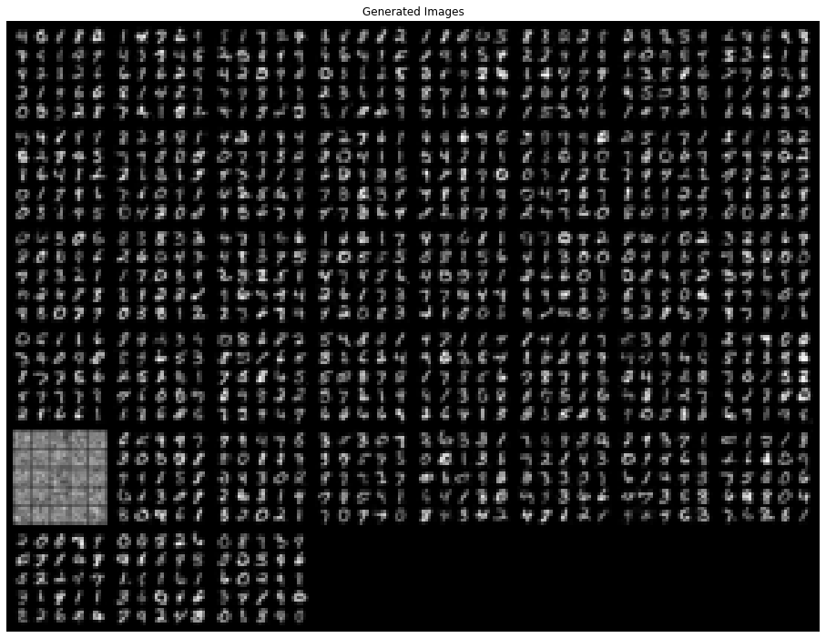

# DCGAN

in the 'DCGAN-celebs' notebook we findout about GAN and DCGAN so in this notebook we wont discuss about GAN or DCGAN and we'll just implement the code.


```
import os
import numpy as np
import math

import torchvision.transforms as transforms
from torchvision.utils import save_image

from torch.utils.data import DataLoader
from torchvision import datasets
import torchvision.utils as vutils
from torch.autograd import Variable

import torch.nn as nn
import torch.nn.functional as F
import torch

from matplotlib import pyplot as plt

print('setup done')
```

    setup done


```
dataset = datasets.MNIST(
    ".",
    train=True,
    download=True,
    transform=transforms.Compose(
        [transforms.Resize(32), transforms.ToTensor(), transforms.Normalize([0.5], [0.5])]
    ),
)
dataloader = torch.utils.data.DataLoader(
    dataset,
    batch_size=64,
    shuffle=True
)

device = torch.device("cuda:0")
```


```
real_batch = next(iter(dataloader))
plt.figure(figsize=(8,8))
plt.axis("off")
plt.title("Training Images")
plt.imshow(np.transpose(vutils.make_grid(real_batch[0].to(device)[:64], padding=2, normalize=True).cpu(),(1,2,0)))
```


    <matplotlib.image.AxesImage at 0x7f0c9f988eb8>





```
def weights_init_normal(m):
    classname = m.__class__.__name__
    if classname.find("Conv") != -1:
        torch.nn.init.normal_(m.weight.data, 0.0, 0.02)
    elif classname.find("BatchNorm2d") != -1:
        torch.nn.init.normal_(m.weight.data, 1.0, 0.02)
        torch.nn.init.constant_(m.bias.data, 0.0)
```


```
class Generator(nn.Module):
    def __init__(self):
        super(Generator, self).__init__()

        self.init_size = 8
        self.l1 = nn.Sequential(nn.Linear(100, 128 * self.init_size ** 2))

        self.conv_blocks = nn.Sequential(
            nn.BatchNorm2d(128),
            nn.Upsample(scale_factor=2),
            nn.Conv2d(128, 128, 3, stride=1, padding=1),
            nn.BatchNorm2d(128, 0.8),
            nn.LeakyReLU(0.2, inplace=True),
            nn.Upsample(scale_factor=2),
            nn.Conv2d(128, 64, 3, stride=1, padding=1),
            nn.BatchNorm2d(64, 0.8),
            nn.LeakyReLU(0.2, inplace=True),
            nn.Conv2d(64, 1, 3, stride=1, padding=1),
            nn.Tanh(),
        )

    def forward(self, z):
        out = self.l1(z)
        out = out.view(out.shape[0], 128, self.init_size, self.init_size)
        img = self.conv_blocks(out)
        return img
```


```
class Discriminator(nn.Module):
    def __init__(self):
        super(Discriminator, self).__init__()

        def discriminator_block(in_filters, out_filters, bn=True):
            block = [nn.Conv2d(in_filters, out_filters, 3, 2, 1), nn.LeakyReLU(0.2, inplace=True), nn.Dropout2d(0.25)]
            if bn:
                block.append(nn.BatchNorm2d(out_filters, 0.8))
            return block

        self.model = nn.Sequential(
            *discriminator_block(1, 16, bn=False),
            *discriminator_block(16, 32),
            *discriminator_block(32, 64),
            *discriminator_block(64, 128),
        )

        # The height and width of downsampled image
        ds_size = 32 // 2 ** 4
        self.adv_layer = nn.Sequential(nn.Linear(128 * ds_size ** 2, 1), nn.Sigmoid())

    def forward(self, img):
        out = self.model(img)
        out = out.view(out.shape[0], -1)
        validity = self.adv_layer(out)

        return validity
```


```
generator = Generator().to(device)
discriminator = Discriminator().to(device)
print(generator, end='\n\n')
print(discriminator)
```

    Generator(
      (l1): Sequential(
        (0): Linear(in_features=100, out_features=8192, bias=True)
      )
      (conv_blocks): Sequential(
        (0): BatchNorm2d(128, eps=1e-05, momentum=0.1, affine=True, track_running_stats=True)
        (1): Upsample(scale_factor=2.0, mode=nearest)
        (2): Conv2d(128, 128, kernel_size=(3, 3), stride=(1, 1), padding=(1, 1))
        (3): BatchNorm2d(128, eps=0.8, momentum=0.1, affine=True, track_running_stats=True)
        (4): LeakyReLU(negative_slope=0.2, inplace=True)
        (5): Upsample(scale_factor=2.0, mode=nearest)
        (6): Conv2d(128, 64, kernel_size=(3, 3), stride=(1, 1), padding=(1, 1))
        (7): BatchNorm2d(64, eps=0.8, momentum=0.1, affine=True, track_running_stats=True)
        (8): LeakyReLU(negative_slope=0.2, inplace=True)
        (9): Conv2d(64, 1, kernel_size=(3, 3), stride=(1, 1), padding=(1, 1))
        (10): Tanh()
      )
    )
    
    Discriminator(
      (model): Sequential(
        (0): Conv2d(1, 16, kernel_size=(3, 3), stride=(2, 2), padding=(1, 1))
        (1): LeakyReLU(negative_slope=0.2, inplace=True)
        (2): Dropout2d(p=0.25, inplace=False)
        (3): Conv2d(16, 32, kernel_size=(3, 3), stride=(2, 2), padding=(1, 1))
        (4): LeakyReLU(negative_slope=0.2, inplace=True)
        (5): Dropout2d(p=0.25, inplace=False)
        (6): BatchNorm2d(32, eps=0.8, momentum=0.1, affine=True, track_running_stats=True)
        (7): Conv2d(32, 64, kernel_size=(3, 3), stride=(2, 2), padding=(1, 1))
        (8): LeakyReLU(negative_slope=0.2, inplace=True)
        (9): Dropout2d(p=0.25, inplace=False)
        (10): BatchNorm2d(64, eps=0.8, momentum=0.1, affine=True, track_running_stats=True)
        (11): Conv2d(64, 128, kernel_size=(3, 3), stride=(2, 2), padding=(1, 1))
        (12): LeakyReLU(negative_slope=0.2, inplace=True)
        (13): Dropout2d(p=0.25, inplace=False)
        (14): BatchNorm2d(128, eps=0.8, momentum=0.1, affine=True, track_running_stats=True)
      )
      (adv_layer): Sequential(
        (0): Linear(in_features=512, out_features=1, bias=True)
        (1): Sigmoid()
      )
    )


```
lr = 0.0002 

generator.apply(weights_init_normal)
discriminator.apply(weights_init_normal)

optimizer_G = torch.optim.Adam(generator.parameters(), lr=lr, betas=(0.5, 0.999))
optimizer_D = torch.optim.Adam(discriminator.parameters(), lr=lr, betas=(0.5, 0.999))

adversarial_loss = torch.nn.BCELoss()

Tensor = torch.cuda.FloatTensor
```


```
n_epochs = 100

for epoch in range(n_epochs):

    for i, (imgs, _) in enumerate(dataloader):

        # Adversarial ground truths
        valid = Variable(Tensor(imgs.shape[0], 1).fill_(1.0), requires_grad=False)
        fake = Variable(Tensor(imgs.shape[0], 1).fill_(0.0), requires_grad=False)

        real_imgs = Variable(imgs.type(Tensor))

        # -----------------
        #  Train Generator
        # -----------------

        optimizer_G.zero_grad()

        z = Variable(Tensor(np.random.normal(0, 1, (imgs.shape[0], 100))))

        gen_imgs = generator(z)

        # Loss measures generator's ability to fool the discriminator
        g_loss = adversarial_loss(discriminator(gen_imgs), valid)

        g_loss.backward()
        optimizer_G.step()

        # ---------------------
        #  Train Discriminator
        # ---------------------

        optimizer_D.zero_grad()

        # Measure discriminator's ability to classify real from generated samples
        real_loss = adversarial_loss(discriminator(real_imgs), valid)
        fake_loss = adversarial_loss(discriminator(gen_imgs.detach()), fake)
        d_loss = (real_loss + fake_loss) / 2

        d_loss.backward()
        optimizer_D.step()
        
        if i % 500 == 0:
            print(
                "[Epoch %d/%d] [Batch %d/%d] [D loss: %f] [G loss: %f]"
                % (epoch, 100, i, len(dataloader), d_loss.item(), g_loss.item())
            )

        batches_done = epoch * len(dataloader) + i
        if batches_done % 400 == 0:
            save_image(gen_imgs.data[:25], "images/%d.png" % batches_done, nrow=5, normalize=True)
```

    [Epoch 0/100] [Batch 0/938] [D loss: 0.692980] [G loss: 0.691828]
    [Epoch 0/100] [Batch 500/938] [D loss: 0.697077] [G loss: 0.688386]
    [Epoch 1/100] [Batch 0/938] [D loss: 0.702745] [G loss: 0.619657]
    [Epoch 1/100] [Batch 500/938] [D loss: 0.668527] [G loss: 0.737931]
    [Epoch 2/100] [Batch 0/938] [D loss: 0.648809] [G loss: 0.852446]
    [Epoch 2/100] [Batch 500/938] [D loss: 0.690274] [G loss: 0.808068]
    [Epoch 3/100] [Batch 0/938] [D loss: 0.707775] [G loss: 0.824631]
    [Epoch 3/100] [Batch 500/938] [D loss: 0.606353] [G loss: 0.727198]
    [Epoch 4/100] [Batch 0/938] [D loss: 0.651710] [G loss: 0.888336]
    [Epoch 4/100] [Batch 500/938] [D loss: 0.775668] [G loss: 0.784597]
    [Epoch 5/100] [Batch 0/938] [D loss: 0.601170] [G loss: 0.879480]
    [Epoch 5/100] [Batch 500/938] [D loss: 0.677455] [G loss: 0.774690]
    [Epoch 6/100] [Batch 0/938] [D loss: 0.614713] [G loss: 0.704724]
    [Epoch 6/100] [Batch 500/938] [D loss: 0.582066] [G loss: 1.158846]
    [Epoch 7/100] [Batch 0/938] [D loss: 0.759856] [G loss: 0.793734]
    [Epoch 7/100] [Batch 500/938] [D loss: 0.631919] [G loss: 1.122203]
    [Epoch 8/100] [Batch 0/938] [D loss: 0.647818] [G loss: 1.758703]
    [Epoch 8/100] [Batch 500/938] [D loss: 0.500094] [G loss: 0.920820]
    [Epoch 9/100] [Batch 0/938] [D loss: 0.533460] [G loss: 0.865770]
    [Epoch 9/100] [Batch 500/938] [D loss: 0.547733] [G loss: 1.049247]
    [Epoch 10/100] [Batch 0/938] [D loss: 0.621024] [G loss: 0.798223]
    [Epoch 10/100] [Batch 500/938] [D loss: 0.599629] [G loss: 1.008676]
    [Epoch 11/100] [Batch 0/938] [D loss: 0.486053] [G loss: 1.018750]
    [Epoch 11/100] [Batch 500/938] [D loss: 0.597966] [G loss: 0.614363]
    [Epoch 12/100] [Batch 0/938] [D loss: 0.551430] [G loss: 0.970711]
    [Epoch 12/100] [Batch 500/938] [D loss: 0.415868] [G loss: 1.339010]
    [Epoch 13/100] [Batch 0/938] [D loss: 0.535133] [G loss: 0.927949]
    [Epoch 13/100] [Batch 500/938] [D loss: 0.459950] [G loss: 0.922038]
    [Epoch 14/100] [Batch 0/938] [D loss: 0.560337] [G loss: 0.999597]
    [Epoch 14/100] [Batch 500/938] [D loss: 0.582854] [G loss: 1.699697]
    [Epoch 15/100] [Batch 0/938] [D loss: 0.431975] [G loss: 1.133040]
    [Epoch 15/100] [Batch 500/938] [D loss: 0.462877] [G loss: 1.104154]
    [Epoch 16/100] [Batch 0/938] [D loss: 0.452518] [G loss: 1.425301]
    [Epoch 16/100] [Batch 500/938] [D loss: 0.636410] [G loss: 1.095453]
    [Epoch 17/100] [Batch 0/938] [D loss: 0.571398] [G loss: 1.061281]
    [Epoch 17/100] [Batch 500/938] [D loss: 0.954977] [G loss: 0.968808]
    [Epoch 18/100] [Batch 0/938] [D loss: 0.606664] [G loss: 0.736512]
    [Epoch 18/100] [Batch 500/938] [D loss: 0.437286] [G loss: 0.895275]
    [Epoch 19/100] [Batch 0/938] [D loss: 0.509797] [G loss: 1.109420]
    [Epoch 19/100] [Batch 500/938] [D loss: 0.504680] [G loss: 1.132285]
    [Epoch 20/100] [Batch 0/938] [D loss: 0.706046] [G loss: 1.306555]
    [Epoch 20/100] [Batch 500/938] [D loss: 0.449006] [G loss: 1.321830]
    [Epoch 21/100] [Batch 0/938] [D loss: 0.637291] [G loss: 1.428362]
    [Epoch 21/100] [Batch 500/938] [D loss: 0.498587] [G loss: 0.985723]
    [Epoch 22/100] [Batch 0/938] [D loss: 0.631230] [G loss: 0.772870]
    [Epoch 22/100] [Batch 500/938] [D loss: 0.525185] [G loss: 1.386898]
    [Epoch 23/100] [Batch 0/938] [D loss: 0.535239] [G loss: 0.533894]
    [Epoch 23/100] [Batch 500/938] [D loss: 0.501170] [G loss: 1.110784]
    [Epoch 24/100] [Batch 0/938] [D loss: 0.400947] [G loss: 1.456943]
    [Epoch 24/100] [Batch 500/938] [D loss: 0.659974] [G loss: 0.868561]
    [Epoch 25/100] [Batch 0/938] [D loss: 0.691961] [G loss: 0.678437]
    [Epoch 25/100] [Batch 500/938] [D loss: 0.562866] [G loss: 1.182923]
    [Epoch 26/100] [Batch 0/938] [D loss: 0.471030] [G loss: 1.428101]
    [Epoch 26/100] [Batch 500/938] [D loss: 0.621334] [G loss: 0.836130]
    [Epoch 27/100] [Batch 0/938] [D loss: 0.446843] [G loss: 1.595668]
    [Epoch 27/100] [Batch 500/938] [D loss: 0.374847] [G loss: 1.765483]
    [Epoch 28/100] [Batch 0/938] [D loss: 0.510894] [G loss: 1.053155]
    [Epoch 28/100] [Batch 500/938] [D loss: 0.686161] [G loss: 0.833766]
    [Epoch 29/100] [Batch 0/938] [D loss: 0.325796] [G loss: 1.580489]
    [Epoch 29/100] [Batch 500/938] [D loss: 0.519603] [G loss: 0.572165]
    [Epoch 30/100] [Batch 0/938] [D loss: 0.530655] [G loss: 1.976421]
    [Epoch 30/100] [Batch 500/938] [D loss: 0.470969] [G loss: 1.484167]
    [Epoch 31/100] [Batch 0/938] [D loss: 0.439854] [G loss: 1.339764]
    [Epoch 31/100] [Batch 500/938] [D loss: 0.745992] [G loss: 1.686178]
    [Epoch 32/100] [Batch 0/938] [D loss: 0.561026] [G loss: 0.946730]
    [Epoch 32/100] [Batch 500/938] [D loss: 0.644698] [G loss: 1.222058]
    [Epoch 33/100] [Batch 0/938] [D loss: 0.308254] [G loss: 1.677568]
    [Epoch 33/100] [Batch 500/938] [D loss: 0.770032] [G loss: 1.121579]
    [Epoch 34/100] [Batch 0/938] [D loss: 0.302354] [G loss: 0.714373]
    [Epoch 34/100] [Batch 500/938] [D loss: 0.698283] [G loss: 0.853195]
    [Epoch 35/100] [Batch 0/938] [D loss: 0.252153] [G loss: 0.756998]
    [Epoch 35/100] [Batch 500/938] [D loss: 0.384456] [G loss: 1.132501]
    [Epoch 36/100] [Batch 0/938] [D loss: 0.166689] [G loss: 0.840974]
    [Epoch 36/100] [Batch 500/938] [D loss: 0.386667] [G loss: 1.401904]
    [Epoch 37/100] [Batch 0/938] [D loss: 0.323520] [G loss: 0.714219]
    [Epoch 37/100] [Batch 500/938] [D loss: 0.348481] [G loss: 1.569324]
    [Epoch 38/100] [Batch 0/938] [D loss: 0.626774] [G loss: 0.489657]
    [Epoch 38/100] [Batch 500/938] [D loss: 0.409886] [G loss: 2.172020]
    [Epoch 39/100] [Batch 0/938] [D loss: 0.711259] [G loss: 3.401111]
    [Epoch 39/100] [Batch 500/938] [D loss: 0.526799] [G loss: 0.865862]
    [Epoch 40/100] [Batch 0/938] [D loss: 0.280150] [G loss: 0.549807]
    [Epoch 40/100] [Batch 500/938] [D loss: 0.544751] [G loss: 1.386268]
    [Epoch 41/100] [Batch 0/938] [D loss: 0.305386] [G loss: 1.182332]
    [Epoch 41/100] [Batch 500/938] [D loss: 0.548538] [G loss: 1.623462]
    [Epoch 42/100] [Batch 0/938] [D loss: 0.376674] [G loss: 1.573915]
    [Epoch 42/100] [Batch 500/938] [D loss: 0.864727] [G loss: 0.966937]
    [Epoch 43/100] [Batch 0/938] [D loss: 0.210025] [G loss: 2.553315]
    [Epoch 43/100] [Batch 500/938] [D loss: 0.382702] [G loss: 0.709754]
    [Epoch 44/100] [Batch 0/938] [D loss: 0.579526] [G loss: 0.959419]
    [Epoch 44/100] [Batch 500/938] [D loss: 0.283991] [G loss: 1.355540]
    [Epoch 45/100] [Batch 0/938] [D loss: 0.365986] [G loss: 1.121264]
    [Epoch 45/100] [Batch 500/938] [D loss: 0.267135] [G loss: 1.408015]
    [Epoch 46/100] [Batch 0/938] [D loss: 0.584890] [G loss: 1.640934]
    [Epoch 46/100] [Batch 500/938] [D loss: 0.172809] [G loss: 1.914748]
    [Epoch 47/100] [Batch 0/938] [D loss: 0.314632] [G loss: 1.540020]
    [Epoch 47/100] [Batch 500/938] [D loss: 0.588709] [G loss: 0.605547]
    [Epoch 48/100] [Batch 0/938] [D loss: 0.242987] [G loss: 2.244170]
    [Epoch 48/100] [Batch 500/938] [D loss: 0.378851] [G loss: 1.029751]
    [Epoch 49/100] [Batch 0/938] [D loss: 0.276321] [G loss: 1.338608]
    [Epoch 49/100] [Batch 500/938] [D loss: 0.364616] [G loss: 1.974008]
    [Epoch 50/100] [Batch 0/938] [D loss: 0.426142] [G loss: 2.663802]
    [Epoch 50/100] [Batch 500/938] [D loss: 0.626822] [G loss: 0.757729]
    [Epoch 51/100] [Batch 0/938] [D loss: 0.422402] [G loss: 3.342525]
    [Epoch 51/100] [Batch 500/938] [D loss: 0.876138] [G loss: 2.263464]
    [Epoch 52/100] [Batch 0/938] [D loss: 0.430617] [G loss: 1.076829]
    [Epoch 52/100] [Batch 500/938] [D loss: 0.542110] [G loss: 0.445726]
    [Epoch 53/100] [Batch 0/938] [D loss: 0.464126] [G loss: 0.790915]
    [Epoch 53/100] [Batch 500/938] [D loss: 0.421599] [G loss: 0.550253]
    [Epoch 54/100] [Batch 0/938] [D loss: 0.354101] [G loss: 1.411754]
    [Epoch 54/100] [Batch 500/938] [D loss: 0.265403] [G loss: 1.016919]
    [Epoch 55/100] [Batch 0/938] [D loss: 0.092733] [G loss: 0.971389]
    [Epoch 55/100] [Batch 500/938] [D loss: 0.438022] [G loss: 1.594966]
    [Epoch 56/100] [Batch 0/938] [D loss: 0.228741] [G loss: 2.991778]
    [Epoch 56/100] [Batch 500/938] [D loss: 0.964180] [G loss: 1.782345]
    [Epoch 57/100] [Batch 0/938] [D loss: 0.381777] [G loss: 1.772519]
    [Epoch 57/100] [Batch 500/938] [D loss: 0.361374] [G loss: 1.372569]
    [Epoch 58/100] [Batch 0/938] [D loss: 0.303842] [G loss: 1.555944]
    [Epoch 58/100] [Batch 500/938] [D loss: 0.368838] [G loss: 0.542318]
    [Epoch 59/100] [Batch 0/938] [D loss: 0.672105] [G loss: 3.661584]
    [Epoch 59/100] [Batch 500/938] [D loss: 0.508502] [G loss: 1.114404]
    [Epoch 60/100] [Batch 0/938] [D loss: 0.902079] [G loss: 2.326315]
    [Epoch 60/100] [Batch 500/938] [D loss: 0.814606] [G loss: 1.331796]
    [Epoch 61/100] [Batch 0/938] [D loss: 0.374052] [G loss: 2.357288]
    [Epoch 61/100] [Batch 500/938] [D loss: 0.317819] [G loss: 1.897717]
    [Epoch 62/100] [Batch 0/938] [D loss: 0.521478] [G loss: 0.701943]
    [Epoch 62/100] [Batch 500/938] [D loss: 0.213141] [G loss: 0.302074]
    [Epoch 63/100] [Batch 0/938] [D loss: 0.958880] [G loss: 0.498884]
    [Epoch 63/100] [Batch 500/938] [D loss: 0.203812] [G loss: 2.559834]
    [Epoch 64/100] [Batch 0/938] [D loss: 0.800144] [G loss: 2.508113]
    [Epoch 64/100] [Batch 500/938] [D loss: 0.406546] [G loss: 1.315957]
    [Epoch 65/100] [Batch 0/938] [D loss: 0.530625] [G loss: 2.451653]
    [Epoch 65/100] [Batch 500/938] [D loss: 0.168766] [G loss: 1.966270]
    [Epoch 66/100] [Batch 0/938] [D loss: 0.156653] [G loss: 1.377409]
    [Epoch 66/100] [Batch 500/938] [D loss: 0.301774] [G loss: 1.182833]
    [Epoch 67/100] [Batch 0/938] [D loss: 0.398380] [G loss: 2.998276]
    [Epoch 67/100] [Batch 500/938] [D loss: 0.422822] [G loss: 3.455522]
    [Epoch 68/100] [Batch 0/938] [D loss: 0.789496] [G loss: 0.948220]
    [Epoch 68/100] [Batch 500/938] [D loss: 0.197835] [G loss: 1.406330]
    [Epoch 69/100] [Batch 0/938] [D loss: 0.470447] [G loss: 0.583043]
    [Epoch 69/100] [Batch 500/938] [D loss: 0.245795] [G loss: 2.785835]
    [Epoch 70/100] [Batch 0/938] [D loss: 0.824579] [G loss: 0.127073]
    [Epoch 70/100] [Batch 500/938] [D loss: 0.874144] [G loss: 0.382354]
    [Epoch 71/100] [Batch 0/938] [D loss: 0.150745] [G loss: 3.728907]
    [Epoch 71/100] [Batch 500/938] [D loss: 0.241439] [G loss: 2.530386]
    [Epoch 72/100] [Batch 0/938] [D loss: 0.470153] [G loss: 0.930737]
    [Epoch 72/100] [Batch 500/938] [D loss: 0.100868] [G loss: 1.633568]
    [Epoch 73/100] [Batch 0/938] [D loss: 0.470944] [G loss: 1.812705]
    [Epoch 73/100] [Batch 500/938] [D loss: 0.441290] [G loss: 1.203964]
    [Epoch 74/100] [Batch 0/938] [D loss: 0.844150] [G loss: 1.461319]
    [Epoch 74/100] [Batch 500/938] [D loss: 0.219311] [G loss: 1.078596]
    [Epoch 75/100] [Batch 0/938] [D loss: 0.488356] [G loss: 2.117969]
    [Epoch 75/100] [Batch 500/938] [D loss: 0.202727] [G loss: 1.271780]
    [Epoch 76/100] [Batch 0/938] [D loss: 0.548877] [G loss: 0.841653]
    [Epoch 76/100] [Batch 500/938] [D loss: 0.268294] [G loss: 2.121329]
    [Epoch 77/100] [Batch 0/938] [D loss: 0.319886] [G loss: 0.401610]
    [Epoch 77/100] [Batch 500/938] [D loss: 0.522882] [G loss: 2.102057]
    [Epoch 78/100] [Batch 0/938] [D loss: 0.513991] [G loss: 2.676735]
    [Epoch 78/100] [Batch 500/938] [D loss: 0.251143] [G loss: 2.504693]
    [Epoch 79/100] [Batch 0/938] [D loss: 0.286535] [G loss: 1.545732]
    [Epoch 79/100] [Batch 500/938] [D loss: 0.676771] [G loss: 0.539245]
    [Epoch 80/100] [Batch 0/938] [D loss: 0.530389] [G loss: 1.097463]
    [Epoch 80/100] [Batch 500/938] [D loss: 0.319152] [G loss: 1.727235]
    [Epoch 81/100] [Batch 0/938] [D loss: 0.526390] [G loss: 0.865822]
    [Epoch 81/100] [Batch 500/938] [D loss: 0.333176] [G loss: 1.208162]
    [Epoch 82/100] [Batch 0/938] [D loss: 0.359928] [G loss: 1.600593]
    [Epoch 82/100] [Batch 500/938] [D loss: 0.948728] [G loss: 0.551739]
    [Epoch 83/100] [Batch 0/938] [D loss: 0.146584] [G loss: 3.059970]
    [Epoch 83/100] [Batch 500/938] [D loss: 0.732803] [G loss: 1.273265]
    [Epoch 84/100] [Batch 0/938] [D loss: 0.667346] [G loss: 3.576129]
    [Epoch 84/100] [Batch 500/938] [D loss: 0.085091] [G loss: 2.238780]
    [Epoch 85/100] [Batch 0/938] [D loss: 0.460545] [G loss: 0.402209]
    [Epoch 85/100] [Batch 500/938] [D loss: 0.386910] [G loss: 2.048024]
    [Epoch 86/100] [Batch 0/938] [D loss: 0.326151] [G loss: 2.889739]
    [Epoch 86/100] [Batch 500/938] [D loss: 0.567378] [G loss: 2.706740]
    [Epoch 87/100] [Batch 0/938] [D loss: 0.499679] [G loss: 1.097349]
    [Epoch 87/100] [Batch 500/938] [D loss: 0.139901] [G loss: 1.965598]
    [Epoch 88/100] [Batch 0/938] [D loss: 0.281333] [G loss: 0.595743]
    [Epoch 88/100] [Batch 500/938] [D loss: 0.321976] [G loss: 1.253505]
    [Epoch 89/100] [Batch 0/938] [D loss: 0.516250] [G loss: 0.837809]
    [Epoch 89/100] [Batch 500/938] [D loss: 0.571589] [G loss: 1.032078]
    [Epoch 90/100] [Batch 0/938] [D loss: 0.641672] [G loss: 2.010365]
    [Epoch 90/100] [Batch 500/938] [D loss: 0.330621] [G loss: 1.123818]
    [Epoch 91/100] [Batch 0/938] [D loss: 0.856299] [G loss: 3.160074]
    [Epoch 91/100] [Batch 500/938] [D loss: 0.118061] [G loss: 1.800994]
    [Epoch 92/100] [Batch 0/938] [D loss: 0.523466] [G loss: 0.318191]
    [Epoch 92/100] [Batch 500/938] [D loss: 0.486312] [G loss: 0.381908]
    [Epoch 93/100] [Batch 0/938] [D loss: 0.374712] [G loss: 1.858689]
    [Epoch 93/100] [Batch 500/938] [D loss: 0.072257] [G loss: 1.446577]
    [Epoch 94/100] [Batch 0/938] [D loss: 0.226714] [G loss: 0.626012]
    [Epoch 94/100] [Batch 500/938] [D loss: 0.393534] [G loss: 3.536390]
    [Epoch 95/100] [Batch 0/938] [D loss: 0.199319] [G loss: 1.709312]
    [Epoch 95/100] [Batch 500/938] [D loss: 0.220158] [G loss: 3.553442]
    [Epoch 96/100] [Batch 0/938] [D loss: 0.438020] [G loss: 1.279630]
    [Epoch 96/100] [Batch 500/938] [D loss: 0.267362] [G loss: 0.828822]
    [Epoch 97/100] [Batch 0/938] [D loss: 0.189742] [G loss: 1.676894]
    [Epoch 97/100] [Batch 500/938] [D loss: 0.109656] [G loss: 4.926761]
    [Epoch 98/100] [Batch 0/938] [D loss: 0.386761] [G loss: 1.157270]
    [Epoch 98/100] [Batch 500/938] [D loss: 0.852480] [G loss: 0.521605]
    [Epoch 99/100] [Batch 0/938] [D loss: 0.414190] [G loss: 3.410188]
    [Epoch 99/100] [Batch 500/938] [D loss: 0.263048] [G loss: 1.405139]


```
! cat ./model/G/model.dms
! cat ./model/D/model.dms
```

    cat: ./model/G/model.dms: No such file or directory
    cat: ./model/D/model.dms: No such file or directory


```
torch.save({
    'model_state_dict': generator.state_dict(),
}, './model/G/model.dms')

torch.save({
    'model_state_dict': discriminator.state_dict(),
}, './model/D/model.dms')
```


```
! mkdir Generated_Images
! mv ./images ./Generated_Images
```


```
dataset = datasets.ImageFolder(root='./Generated_Images/', transform=transforms.Compose(
        [transforms.Resize(32), transforms.ToTensor(), transforms.Normalize([0.5], [0.5])]
    ),
)

dataloader = torch.utils.data.DataLoader(dataset, batch_size=64, shuffle=True)
```


```
for i, (imgs, _) in enumerate(dataloader):
    plt.figure(figsize=(16,16))
    plt.axis("off")
    plt.title("Generated Images")
    plt.imshow(np.transpose(vutils.make_grid(imgs.to(device)[:64], padding=2, normalize=True).cpu(),(1,2,0)))
```










