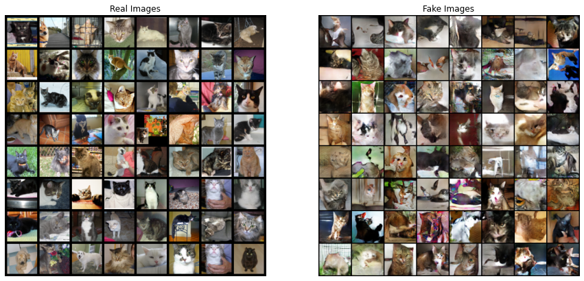

# My Personal GAN-Projects
##### Collection of PyTorch implementations of Generative Adversarial Network varieties presented in research papers. 
GAN is one of my main interests and research cases.  
The main purpose of the repository is to implement the models I have read on the papers for deeper understanding and more practice on GAN and famous frameworks like Pytorch or Tensorflow. 
But of course, model architectures will not exactly the same as proposed in the papers.

### Projects
 * [ThisAnimeCharacterDoesntExist](#thisanimecharacterdoesntexist)
 * [ThisPersonDoesntExist](#thispersondoesntexist)
 * [ThisCatDoesntExist](#thiscatdoesntexist)
 * [NumberGenerator](#numbergenerator)
 * [MonetToPhoto](#monettophoto)
  
 
## ThisAnimeCharacterDoesntExist
## ThisPersonDoesntExist
## ThisCatDoesntExist
_Deep Convolutional Generative Adversarial Network_
#### ABSTRACT
DCGAN implementation of cats dataset. I've implemented a model that generates 64 * 64 images of cats.  

[[Paper]](https://arxiv.org/abs/1511.06434) [[Code]](DCGAN/ThisCatDoesntExist)

## NumberGenerator
## MonetToPhoto
